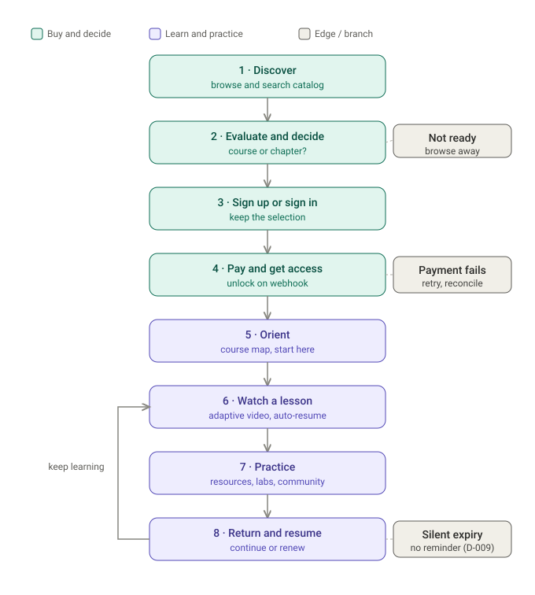
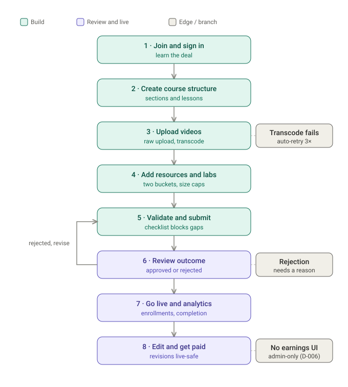
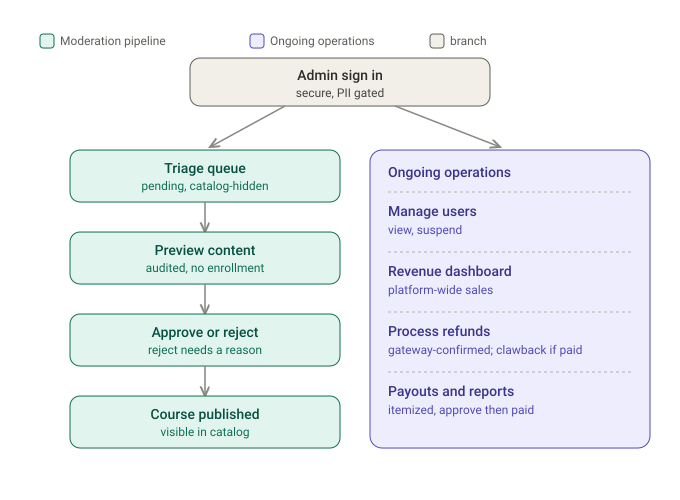

# User Journeys

> Status: Draft
> Last Updated: 2026-07-21

Task-based user journeys (not page-based) for the three Gradex roles — student, instructor, admin. Each task lists goals, user actions, decisions, edge cases, possible errors, and opportunities for delight. Every step is grounded in the current product docs; rule references point to [BUSINESS_RULES.md](BUSINESS_RULES.md) (BR-xxx), [DECISIONS.md](DECISIONS.md) (D-xxx), and [PRD.md](PRD.md).

Scope note: journeys reflect the **MVP launch product** — single course/chapter purchase, card/KNET checkout, semester-length access, external community. Bundles, BNPL installments, and certificates are post-launch (see [DECISIONS.md](DECISIONS.md) D-008, [PRD.md §4 Scope](PRD.md)) and are not part of these flows.

---

# 1. Student Journey — buy & watch a course

```
TASK FLOW (student)

Discover ──▶ Evaluate & decide ──▶ Sign up / sign in ──▶ Pay & get access
                   │                                             │
                   └──▶ (not ready) leave / bounce               ▼
                                                          Orient (dashboard)
                                                                 │
                                                                 ▼
   Return & resume ◀── Practice (resources·labs·community) ◀── Watch a lesson
        │                                                        ▲
        └────────────────── loop until done / expiry ───────────┘
```



## T1 — Discover a course
- **Goal:** Find a course matching a specific university subject/level.
- **Actions:** Browse catalog, filter by major/year, search by course name, open chapters within a course.
- **Decisions:** Whole course or single chapter? Is my subject even here?
- **Edge cases:** Empty/thin catalog at launch (8–12 courses); subject not covered; only one instructor.
- **Errors:** Slow catalog load on 4G (target p95 <2.5s LCP); broken thumbnail.
- **Delight:** "Which course for [my university course code]?" helper; free preview lesson per course; "students in your major bought" hint.

## T2 — Evaluate & decide
- **Goal:** Judge if the course is worth 30–60 KWD vs. cheaper alternatives.
- **Actions:** Read outline (sections/lessons), watch preview, check included labs/resources, see price + access term.
- **Decisions:** Trust the value? Buy course or just one chapter? Now or later?
- **Edge cases:** Course not yet published; price mid-change (student sees last-approved price, BR-017); already owns it (BR-024) → show "Go to course", not "Buy".
- **Errors:** Price/scope mismatch between catalog and checkout.
- **Delight:** Make the price gap legible — visible lab/community/follow-up (Risk 4); show "access until [date]" concretely, not "150 days"; sample lab download.

## T3 — Sign up / sign in
- **Goal:** Get an account with minimum friction, without losing the chosen course.
- **Actions:** Register (unique email + password) or log in; return to the course.
- **Decisions:** Sign up now or after choosing to buy? (Recommend: "buy" triggers auth, then returns to checkout.)
- **Edge cases:** Duplicate email (BR-001 → 409); suspended account (BR-007 → blocked); logged-out mid-purchase.
- **Errors:** 409 duplicate; 401 bad credentials with no email-exists leak (BR-003); refresh token expired mid-flow (BR-005).
- **Delight:** Preserve the chosen course across signup (deep-link back to checkout); social proof on the auth screen.

## T4 — Pay & get access
- **Goal:** Pay safely and know instantly access is granted.
- **Actions:** Confirm item, pay via hosted card/KNET checkout, wait for confirmation.
- **Decisions:** Payment method (card vs KNET); retry vs abandon on failure.
- **Edge cases:** Access granted **only** on gateway webhook success, never on redirect (BR-020); ambiguous timeout → reconcile before re-attempt (BR-022, BR-034); re-buying an active enrollment blocked (BR-024).
- **Errors:** Declined/cancelled/timeout → order failed, no access, clear retry (BR-022); delayed webhook → "confirming payment…" holding state, not a false failure; duplicate webhook cannot double-charge (BR-033).
- **Delight:** Instant email + in-app receipt (BR-121); reassuring "we've got your payment, unlocking now" state if the webhook lags; one-tap into the first lesson on success.

## T5 — Orient (course dashboard)
- **Goal:** Understand what was bought and where to start.
- **Actions:** See course map, progress = 0%, access-until date, first-lesson CTA, resources/labs, community link.
- **Decisions:** Start now or later? In order or jump?
- **Edge cases:** Chapter-only purchase → non-owned lessons visibly locked (BR-021, BR-023); enrollment near expiry.
- **Errors:** Progress fails to load; locked lesson mistakenly shown unlocked.
- **Delight:** "Start here" nudge; estimated time-to-complete; warm first-purchase welcome (brand: no student left alone).

## T6 — Watch a lesson
- **Goal:** Watch smoothly and never lose their place.
- **Actions:** Play (HLS adaptive), pause/seek/quality/fullscreen, auto-resume from last position (BR-052), auto-mark complete at ≥90% (BR-051).
- **Decisions:** Which quality; rewatch vs advance; mark done manually?
- **Edge cases:** Signed URL expires mid-session → silent token refresh, no interruption (BR-053, BR-100); seek-back never un-completes (BR-051); expired enrollment mid-watch → access-denied, not silent retry (BR-023 vs BR-053).
- **Errors:** 403 on segment → refresh + retry once (BR-053); CDN/storage outage → distinguishable error; progress POST fails → silent retry next tick.
- **Delight:** Resume banner "Pick up at 12:04"; remember playback speed/quality; keyboard-first player (accessibility); auto-advance to next lesson.

## T7 — Practice (resources, labs, community)
- **Goal:** Apply the lesson with real materials and peers.
- **Actions:** Download lesson resources (slides/notes) and lab materials (project + guide); open community link.
- **Decisions:** Do the lab now or later; ask the community?
- **Edge cases:** Entitlement + expiry checked before every download (BR-023); resources un-watermarked, labs buyer-tagged (BR-103, D-011); external Discord could be dead/unmoderated (Risk 2).
- **Errors:** Download link expired → re-issue; wrong-type/over-cap file (shouldn't reach student); broken Discord link.
- **Delight:** Lab setup checklist to cut environment-setup drop-off (PRD assumption); "mark lab done"; community deep-link to the right channel; leak-tracing tag invisible to honest users.

## T8 — Return & resume (and eventually renew)
- **Goal:** Come back days later and continue effortlessly; understand when access ends.
- **Actions:** Log in → "Continue learning" → resume exact lesson/position; check access-until; re-purchase after expiry via normal checkout (BR-025).
- **Decisions:** Continue vs restart; renew after a lapsed semester?
- **Edge cases:** Silent expiry — access just ends, no renewal flow in MVP (D-009); after expiry, BR-024 allows re-buy.
- **Errors:** Resume points to a lesson whose video was replaced (progress preserved, BR-059); stale session token.
- **Delight (biggest gap today):** MVP ships *silent* expiry — an expiry reminder ("7 days of access left") is a post-launch lifecycle notification (D-010) and a strong retention win; "welcome back, here's what's new" on return.

---

# 2. Instructor Journey — build, publish, get paid

```
TASK FLOW (instructor)

Join & sign in ──▶ Create course structure ──▶ Upload videos ──▶ Add resources & labs
                                                                          │
                                                                          ▼
        Get paid ◀── Track analytics ◀── Go live ◀── Review outcome ◀── Validate & submit
             ▲                                          │
             │                                   (rejected) revise ──┐
             └──────── edit published (pending-revision) ◀───────────┘
```



## T1 — Join & sign in
- **Goal:** Get an instructor account and understand the deal.
- **Actions:** Onboard (recruited manually pre-launch), sign in.
- **Decisions:** Commit content time before seeing an earnings UI?
- **Edge cases:** No self-serve instructor signup specced; suspended instructor blocked from editing (BR-065).
- **Errors:** Auth errors as per student.
- **Delight:** Clear, documented payout cadence up front (Risk 6) — trust before there's a dashboard.

## T2 — Create course structure
- **Goal:** Model the course as Course → Section → Lesson.
- **Actions:** Create course (starts Draft, invisible — BR-011), add/reorder/delete sections & lessons (BR-010), set price.
- **Decisions:** Course vs chapter granularity; ordering; pricing in the 30–60 KWD band.
- **Edge cases:** Own courses only (BR-060); ordering must persist.
- **Errors:** Reorder not saved; duplicate/empty titles.
- **Delight:** Templated course skeleton; autosave; live student-preview.

## T3 — Upload lesson videos
- **Goal:** Get a watchable lesson video with minimal fuss.
- **Actions:** Raw upload → async transcode → status until READY (BR-062, BR-091).
- **Decisions:** Re-upload/replace a bad take?
- **Edge cases:** Transcode FAILED → auto-retry 3× then manual (BR-091); launch-week upload spike may exceed workers (Risk 5); replace preserves progress (BR-059).
- **Errors:** Upload over `MAX_UPLOAD_SIZE_BYTES`; stuck UPLOADING (reaper); transcode failure with no alert.
- **Delight:** Clear per-stage progress (uploading→processing→ready); "your video is ready" notification; resumable uploads on flaky connections.

## T4 — Add resources & labs
- **Goal:** Attach the right materials to each lesson.
- **Actions:** Upload lesson resources (slides/notes, ≤50 MB/file, 200 MB/lesson) and lab materials (project + guide, ≤250 MB/file, 1 GB/lesson) — separate buckets (D-011, BR-067/068).
- **Decisions:** Which bucket a file belongs in; how much practice to include.
- **Edge cases:** Over-cap upload rejected (BR-068); replace overwrites in place, no versioning (BR-066).
- **Errors:** Wrong file type rejected; over-cap rejected with a clear message.
- **Delight:** Drag-drop with instant size/type validation; per-lesson "materials complete" indicator.

## T5 — Validate & submit for review
- **Goal:** Submit a complete course confidently.
- **Actions:** Submit → moves to Pending Approval (BR-070).
- **Decisions:** Ready, or missing content?
- **Edge cases:** Blocked if any lesson lacks a READY video or the course has zero sections/lessons, with a message naming what's missing (BR-012, BR-013).
- **Errors:** Submit attempted while a video is still transcoding.
- **Delight:** Pre-submit checklist showing exactly what's blocking; one-click "fix" jumps to the gap.

## T6 — Handle review outcome
- **Goal:** Get approved, or fix and resubmit fast.
- **Actions:** Wait (course read-only during review, BR-016); on approval → Published + notified (BR-071); on rejection → reason shown, back to Draft, editable (BR-072, BR-015).
- **Decisions:** How to address the rejection reason.
- **Edge cases:** Can't edit while Pending (BR-016); rejection always carries a reason (BR-072).
- **Errors:** Notification not delivered (best-effort, BR-120) → dashboard status is the source of truth.
- **Delight:** Specific, kind rejection feedback; review ETA; in-app + email approval ping (D-010).

## T7 — Go live & track analytics
- **Goal:** See the course perform.
- **Actions:** View per-course enrollments, completion rate, own student roster (BR-064).
- **Decisions:** Iterate content based on completion drop-off?
- **Edge cases:** **No earnings/payout figures** anywhere instructor-facing (BR-064, BR-074, D-006).
- **Errors:** Analytics lag.
- **Delight:** Per-lesson completion funnel (where students drop); "N students started this week."

## T8 — Edit published course & get paid
- **Goal:** Improve a live course without disrupting students; receive payouts.
- **Actions:** Edit → creates a pending-revision; live course stays up and unchanged until admin re-approves (BR-017, BR-090); receive periodic manual payout statement (emailed PDF/CSV, D-006, Risk 6).
- **Decisions:** Edit now or batch changes.
- **Edge cases:** Price change also goes through review (BR-017); refund may reduce a not-yet-paid payout (BR-043).
- **Errors:** Revision rejected → discarded, live untouched.
- **Delight:** "Draft changes" preview; predictable payout statement each cycle; a real earnings dashboard is the top post-v1 ask (Risk 6).

---

# 3. Admin Journey — moderate, support, settle money

```
TASK FLOW (admin)

Sign in ──▶ Triage moderation queue ──▶ Preview content ──▶ Approve / Reject
   │                                                              │
   ├──▶ Manage users (suspend)                                    ▼
   ├──▶ Watch revenue dashboard                            course Published
   ├──▶ Process refunds ──▶ (clawback if payout paid)
   ├──▶ Run instructor payouts (approve ▶ paid)
   └──▶ Moderate reported content
```



## T1 — Sign in
- **Goal:** Secure privileged access.
- **Actions:** Admin login; only admins see PII (BR-101).
- **Edge cases:** Session revocation (BR-006).
- **Errors:** Auth as above.
- **Delight:** Ops landing — what needs attention today (queue depth, pending refunds, failed transcodes).

## T2 — Triage moderation queue
- **Goal:** Clear the review backlog.
- **Actions:** See Pending Approval courses (BR-070), hidden from catalog.
- **Decisions:** Priority order.
- **Edge cases:** Launch-week batch of 8–12 courses at once (Risk 5).
- **Errors:** Queue not reflecting a just-submitted course.
- **Delight:** Age/SLA on each queued item; bulk triage.

## T3 — Preview content
- **Goal:** Watch lesson videos to judge quality without owning the course.
- **Actions:** Audited admin preview of any lesson incl. Draft/Pending (BR-081) — logged (admin ID, lesson, timestamp), no enrollment created.
- **Edge cases:** Distinct authorization path from student playback (BR-050 vs BR-081).
- **Errors:** Preview denied due to a missing preview path (would block review).
- **Delight:** Reviewer checklist overlay; scrub without full watch.

## T4 — Approve / reject
- **Goal:** Publish good courses, return weak ones with clear guidance.
- **Actions:** Approve → Published + notify instructor (BR-071); reject → required reason, back to Draft (BR-072).
- **Decisions:** Meets bar? What to cite on rejection.
- **Edge cases:** Approving a pending-revision applies changes atomically to the live course (BR-017, BR-090).
- **Errors:** Approve fails mid-publish → course must not end up half-visible.
- **Delight:** Reason templates for common rejections; preview-as-student before approving.

## T5 — Manage users
- **Goal:** Keep the platform safe.
- **Actions:** View users, suspend students/instructors (BR-007, BR-065).
- **Decisions:** Suspend vs warn.
- **Edge cases:** Suspending a student kills access despite prior purchases (BR-007); suspending an instructor does not revoke enrolled students' access (BR-065).
- **Errors:** Suspension not propagating to active sessions/playback.
- **Delight:** Reason + audit trail; reversible suspend.

## T6 — Watch revenue dashboard
- **Goal:** See platform financial health.
- **Actions:** View platform-wide revenue/payments.
- **Edge cases:** Refund reduces revenue for the period but not historical enrollment counts (BR-045).
- **Errors:** Webhook desync between payment state and records (Risk 1) — needs a reconciliation view.
- **Delight:** Refund/chargeback trend; per-course revenue.

## T7 — Process refunds
- **Goal:** Refund fairly and safely.
- **Actions:** Admin-only refund (BR-040) → call gateway → revoke access **only after** gateway confirms (BR-041), pending-refund state meanwhile; log for audit (BR-042).
- **Decisions:** Eligible? (14-day right minus digital-once-accessed exemption, BR-044.)
- **Edge cases:** Partial refund scoped to item; if instructor payout already Paid → flag for clawback (BR-043).
- **Errors:** Gateway refund fails → don't revoke; ambiguous state → reconcile.
- **Delight:** Inline policy check (streamed? file opened?); one-click audit export.

## T8 — Run payouts & moderate reports
- **Goal:** Pay instructors correctly; keep content clean.
- **Actions:** Payout screen itemized by course/purchase, fees + refunds pre-deducted → mark "Approved" then "Paid" with a reference (BR-073); moderate reported courses/materials.
- **Decisions:** Cycle timing; clawback handling.
- **Edge cases:** Refund after "Paid" → manual clawback next cycle (BR-043); never expose earnings to the instructor UI (BR-074).
- **Errors:** Double-payout; mismatch vs gateway.
- **Delight:** Auto-generated statement PDF/CSV per instructor (Risk 6); reconciliation flags before "Paid".

---

# Cross-cutting notes

- **Silent expiry is the clearest delight/retention gap.** The student "return & renew" task has no reminder in MVP (D-009); an expiry-reminder notification is a post-launch lifecycle win (D-010).
- **External community is a fragile USP surface.** The student "practice" task depends on an off-platform Discord/Telegram with no in-platform control (Risk 2) — needs an assigned moderator.
- **No instructor earnings visibility in MVP** (D-006) shapes the whole instructor "get paid" task around a manual statement — trust-sensitive pre-launch (Risk 6).
