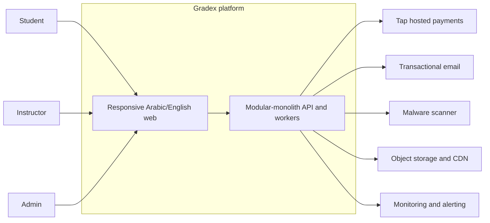
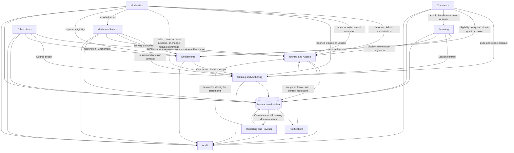
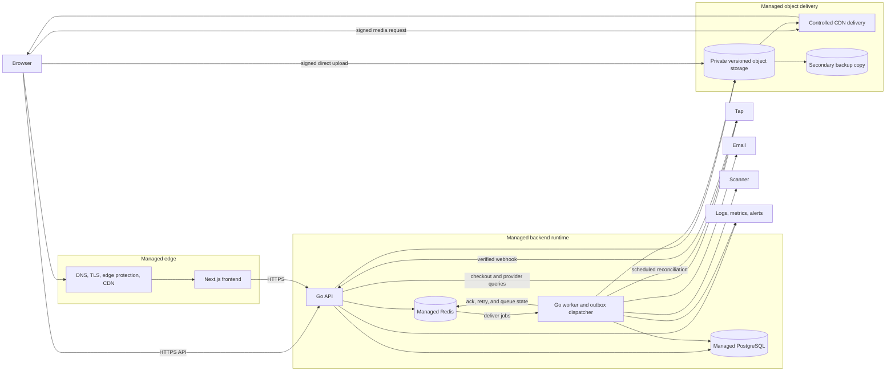

# Gradex Platform Architecture — Design Record

> Status: Approved by developer/product owner; independently approved at `c9c2238`
> Date: 2026-07-25
> Scope: MVP platform architecture and provisional production topology
> Change boundary: Design only; no production infrastructure or application behavior is
> implemented by this record

## 1. Purpose and Authority

This record defines the platform boundary that the July 26–28 domain, API/security, and delivery
foundation work must refine. It is constrained by the
[Gradex Constitution](../../../.specify/memory/constitution.md),
[PRD](../../PRD.md), [Decisions](../../DECISIONS.md),
[Business Rules](../../BUSINESS_RULES.md), [Domain Model](../../DOMAIN_MODEL.md), and
[launch workflow](../../launch/PLAN.md).

The architecture is intentionally provisional where a required launch gate remains open.
[LAUNCH_GATES.md](../../LAUNCH_GATES.md) remains authoritative for production approval; approving
this record does not approve a provider, budget, legal position, recovery envelope, or production
release.

The current repository supplies a Next.js frontend, a Go API process, a Go/asynq worker,
PostgreSQL, Redis, S3-compatible storage, and an implemented video-processing/playback slice. Real
authentication and Entitlements are not yet implemented. This design preserves that working slice
while placing it inside the complete MVP architecture described by the canonical product
documents.

The five conversational approval sections map to this formal record as follows: Section 1 maps to
§§2–3, Section 2 to §§4–6, Section 3 to §§7–8, Section 4 to §§9–10, and Section 5 to §§11–14.

## 2. Architecture Decision

Gradex will use a **modular monolith deployed as a split managed PaaS**:

- one codebase with explicit domain-module ownership;
- an edge-hosted Next.js frontend;
- a separately deployed Go API;
- a separately deployed Go worker;
- managed PostgreSQL as the authoritative datastore;
- managed Redis as disposable queue/cache infrastructure;
- managed object storage and CDN delivery;
- replaceable adapters for Tap, email, malware scanning, secrets, and monitoring.

The architecture optimizes for low operational burden for a solo developer. It permits moderately
higher managed-service cost but avoids permanent overprovisioning before the operating envelope is
approved under `LG-019`.

### 2.1 Alternatives considered

| Approach | Benefit | Reason not selected |
|---|---|---|
| Unified managed PaaS | One console, fast initial setup | Stronger platform coupling and fewer independent region/runtime choices |
| Split managed PaaS | Low operations with independently scalable frontend, API, worker, data, and media | Selected; some cross-provider configuration remains |
| Cloud-managed primitives | Most control and regional flexibility | Networking, identity, and operational work are too high for the solo-operated August 15 launch |

### 2.2 Explicit non-goals

- Kubernetes, active-active regions, and speculative microservice decomposition.
- A self-managed production database, Redis server, or object-storage cluster.
- Passing video or large downloadable bytes through the Go API.
- Provider-specific behavior in domain modules.
- Treating open gates or provisional values as production approval.

## 3. Architectural Drivers and Operating Envelope

### 3.1 Durable drivers

- Public go-live is targeted for 2026-08-15 and remains readiness-gated.
- One developer operates the product with Codex as builder and Claude as independent reviewer.
- The modular monolith remains the default under Constitution Principle VI.
- The current Go, Next.js, PostgreSQL, Redis/asynq, FFmpeg, and S3-compatible implementation is
  preserved.
- The API and worker must scale independently.
- PostgreSQL is authoritative. Redis may transport work, cache data, and coordinate rate limits,
  but losing Redis must not lose authoritative business intent.
- External providers remain replaceable and testable.
- The launch is single-region; multi-region active-active behavior is not an MVP requirement.

### 3.2 PRD targets

- Core catalog, purchase, and playback paths target 99.5% monthly availability.
- Read APIs target p95 latency below 300 milliseconds.
- Transactional writes target p95 below 800 milliseconds, excluding payment-gateway latency.
- Entitled video targets p95 time-to-first-frame below 3 seconds when the selected media-delivery
  path is healthy.
- Public catalog/Course pages target p95 LCP below 2.5 seconds on representative Kuwait 4G.

### 3.3 Provisional load-test floor

These are validation values, not an approved demand forecast:

- 5,000 registered accounts;
- 500 concurrent platform sessions;
- 100 concurrent playback starts, with media bytes served by object storage/CDN;
- 100 API requests per second for short bursts;
- 20 concurrent direct uploads;
- no more than two simultaneous transcodes per worker instance.

### 3.4 Provisional recovery targets

| Asset or service | Provisional target |
|---|---|
| PostgreSQL | RPO no greater than 15 minutes; RTO no greater than 4 hours |
| Source media | Durability posture, not an SLO: versioned durable object storage; successfully completed uploads should not be lost under normal provider failure scenarios |
| Secondary source-media backup | Backup-copy RPO no greater than 24 hours; recovery RTO no greater than 8 hours |
| Derived HLS assets | Reproducible from retained source media |
| Redis | No authoritative durability requirement; queued intent is reconstructed from PostgreSQL |
| Application deployment | Previous known-good frontend/API/worker versions restorable within 30 minutes |

The final budget, load forecast, instance sizes, minimum replicas, availability tier, RPO, and RTO
remain blocked on `LG-019`.

### 3.5 Provisional region boundary

There is no assumed hard data-residency requirement before counsel resolves `LG-004`. The
provisional topology prefers a suitable managed Middle East region, encrypts protected data in
transit and at rest, documents cross-border handling, and preserves a credible provider/data
migration path.

## 4. System Context

- **Students** discover, purchase, learn, download entitled materials, join office hours, and
  maintain progress.
- **Instructors** author Courses, upload assets, respond to Course review feedback, and inspect
  permitted operational reports.
- **Admins** manage identity, taxonomy, pricing, Course publication, moderation, refunds, payouts,
  and platform operations.
- Gradex owns all business authority. Redirects, provider state, cache entries, and browser state
  are never independently authoritative.

## 5. Runtime Containers

| Container | Primary responsibility | Must not own |
|---|---|---|
| Next.js frontend | Public and authenticated presentation, localization, interaction, and calls to the API | Authoritative authorization, payment state, Entitlements, secrets, or business invariants |
| Go API | Synchronous HTTP application boundary: enforce access and coordinate domain commands, queries, webhooks, signed-access issuance, and durable work intent | Large media transfer, FFmpeg, long-running provider work, or presentation state |
| Go worker | Asynchronous execution boundary: dispatch outbox work and perform idempotent media, scanning, email, reconciliation, cleanup, projection, and scheduled jobs | Public ingress or independent business authority |
| PostgreSQL | Authoritative business state, transactional outbox, audit, reconciliation state, and provider-reference mirrors | Large media bytes or ephemeral cache state |
| Redis | Queue transport, cache, and rate-limit coordination | Irreplaceable jobs, Entitlements, payment truth, or unrecoverable state |
| Object storage/CDN | Versioned source objects, quarantine, private derived assets, controlled previews, backup copy, and byte delivery | Course publication, Entitlement, payment, or moderation decisions |

Managed secrets and monitoring are operational facilities rather than domain containers. Tap,
email, and malware scanning remain external systems accessed only through adapters.

## 6. Modular-Monolith Boundaries

| Module | Primary responsibility | Must not own |
|---|---|---|
| Identity and Access | Accounts, credentials, sessions, invitations, roles, ownership checks, and suspension | Course/content, commerce, Entitlement, or learning state |
| Catalog and Authoring | Courses, Sections, Lessons, taxonomy, pricing, per-Course community link, Course-facing review feedback, revisions, and publication | Payments, Entitlements, Student Content Reports, media bytes/processing, or Audit evidence |
| Media and Assets | Upload intent, quarantine, validation/scanning workflow, video processing, resources, lab materials, previews, and signed delivery | Course publication, Entitlement grants, payments, or moderation outcomes |
| Commerce | Coupons, Orders, Tap payment attempts, refunds, reconciliation, receipts, and financial state | Raw card/PAN data, catalog-price authority, Enrollment/progress, or invented provider/policy defaults |
| Entitlements | Grant records, validity, scope evaluation, expiry, and revocation | Account/session, Catalog lifecycle, Enrollment/progress, or payment/refund state |
| Learning | Durable Enrollment create/reuse, Instructor Course-scoped roster/learning analytics, progress, completion, and Student learning history | Account contact/credentials, commerce, Catalog authoring, or Entitlement validity |
| Office Hours | Session schedules, meeting-link disclosure, lifecycle, and external meeting-provider references | Per-Course community links, built-in conferencing, Account state, or Entitlement authority |
| Moderation | Student Content Reports, triage, resolution, and Admin enforcement orchestration | Catalog/Account source records, Course review workflow, or Audit evidence |
| Notifications | Durable per-recipient in-app records/read state, transactional templates, deduplication, email attempts, and suppression | Originating business transactions, Account contact ownership, or marketing automation |
| Reporting and Payouts | Admin commercial/operational projections, Instructor payout statements, revenue shares, and payout records | Source commerce/learning state, Instructor roster PII, or automated settlement |
| Audit | Append-only evidence for privileged and financially sensitive actions | Mutable workflows or source business state |

Catalog owns only Course-facing review state and feedback. Student reports, moderation decisions,
and enforcement are Admin workflows owned by Moderation; their privileged actions are recorded by
Audit. Learning owns Enrollment so Entitlement expiry can end access without deleting the durable
Course relationship, progress, or least-privilege Instructor roster projection.
*(BR-025/064/105/114/145/146)*

Learning is the sole owner of the Instructor's Course-scoped roster and enrollment/progress
analytics. Reporting may consume aggregate Learning events for Admin operations but does not own
the roster or expose additional Student identity. Notifications writes the durable in-app record;
email remains a best-effort mirror and never defines whether a Notification exists.
*(BR-064/101/120/122/123)*

### 6.1 Dependency rules

- A module owns its invariants and tables. Another module cannot write them directly.
- Synchronous cross-module decisions use small, explicit application contracts.
- An application coordinator may invoke multiple module commands inside one PostgreSQL transaction
  when the business invariant requires atomicity.
- Optional side effects, external delivery, and projections use a transactional outbox.
- Notifications and reporting never block the business transaction that produced their event.
- Domain modules depend on interfaces; provider SDKs and transport details stay in outer adapters.
- Existing video behavior moves behind Catalog, Media, and Entitlement contracts without rewriting
  the working transcoding pipeline merely to fit the new package layout.

The arrows represent use of an explicit contract, not permission to write another module's tables.
Audit calls participate in the originating transaction for actions whose evidence must be atomic
with the state change. Reporting projections use published domain events rather than reading source
module tables; Identity resolves the minimum Instructor contact needed for statement delivery.

## 7. Runtime Topology

The topology diagram shows allowed connectivity, not a mandatory serial request path.

### 7.1 Network boundaries

- Only the frontend, API, approved webhook routes, and deliberately published CDN assets are
  publicly reachable.
- Workers have no public ingress.
- PostgreSQL and Redis use private networking or tightly restricted service access.
- Object-storage buckets are private by default.
- Tap, email, scanning, and monitoring calls use encrypted provider endpoints.
- A storage key, provider secret, database credential, or internal queue payload is never exposed
  as an application authorization mechanism.

### 7.2 Scaling

- The edge platform manages frontend scaling.
- The stateless API supports horizontal scaling and health-checked deployment. It may run one
  instance at low launch load and scale to at least two when availability, traffic, or deployment
  requirements justify it.
- Workers scale separately using queue depth and oldest-job age. Media queues are isolated from
  short operational jobs so transcodes cannot starve payment, notification, or reconciliation work.
- One worker instance runs no more than two simultaneous transcodes under the provisional profile.
- PostgreSQL scales vertically first. Read replicas, partitioning, or an external search index
  require measured evidence.
- Redis is scaled for queue/cache availability, not as a source of truth. PostgreSQL outbox
  reconciliation restores missing work.

## 8. Build, Deployment, and Environment Isolation

- The monorepo produces three immutable deployables: frontend, Go API, and Go worker.
- The API and worker may share one backend image with distinct startup commands.
- Staging and production have separate projects, databases, Redis instances, buckets, credentials,
  webhook endpoints, sender identities, and encryption/secrets configuration.
- Staging resources may use smaller sizes or scale to zero while inactive; this cost control does
  not weaken isolation from production.
- Production data is not copied into staging without an approved sanitization process.
- Schema migrations run as a controlled one-off release job.
- Migrations follow expand–migrate–contract so old and new application versions may overlap.
- API releases are health-checked; workers drain or safely retry in-flight jobs.
- Frontend, API, and worker deploy and roll back independently.
- Database correction uses forward migrations rather than destructive schema reversal.
- Configuration is environment-driven, typed, and validated at startup.

Final provider names, plans, region, high-availability tiers, minimum replicas, and autoscaling
thresholds are resolved only when the applicable launch gates have evidence.

## 9. Critical Interaction Patterns

### 9.1 General write and asynchronous-work pattern

1. The API authenticates, authorizes, validates, and checks idempotency where required.
2. Authoritative state and required Audit/outbox records commit in one PostgreSQL transaction.
3. The worker process's outbox-dispatch loop publishes committed intent to Redis independently of
   the API request lifecycle.
4. A worker claims and executes work idempotently.
5. Results, attempt counts, and terminal failures return to PostgreSQL.
6. Retries use bounded exponential backoff with jitter. Exhausted work becomes a visible
   operational failure.

Idempotency keys are mandatory for sensitive commands and externally retried writes, including
Order creation, payment actions, refunds, upload completion, retries, and equivalent operations.
They are not required for reads or every ordinary API request.

### 9.2 Purchase and Entitlement

- Order acceptance snapshots the purchased Course/Section, approved revision, price, currency,
  expiry, and Coupon result; a paid Coupon Order reserves exact capacity through its deadline.
- Tap-hosted checkout receives a stable Gradex Order/payment-attempt reference.
- A browser redirect is presentation-only and never grants access.
- Verified callbacks are stored and deduplicated before processing.
- Verified timely capture, Coupon reservation consumption where applicable, Enrollment
  create-or-reuse, and source-unique Entitlement grant commit atomically.
- A zero-total Coupon Order skips Tap and commits its `FREE_GRANTED` outcome, Coupon redemption,
  Enrollment create-or-reuse, and Entitlement grant in one Order-keyed idempotent transaction.
- Duplicate, delayed, reordered, or conflicting callbacks cannot double-grant access.
- An unknown result remains pending and enters reconciliation.
- Confirmed refund state, its Entitlement effect, and any cumulative-full-refund release of the
  Student's Coupon eligibility commit atomically under the approved policy.

This preserves Constitution Principle IV and the detailed behavior in the
[Coupons design](2026-07-22-coupons-system-design.md).
*(BR-020/BR-022/BR-031/BR-033/BR-047/BR-121/BR-126/BR-129/BR-131)*

### 9.3 Media and downloadable assets

- Upload intent creates an asset/version record before constrained signed access is issued.
- Uploads land in private quarantine.
- Completion verifies the expected object, size, content/type, and ownership before recording
  durable work intent.
- Scanning fails closed. Unavailable or failed scanning leaves applicable content quarantined.
- Approved video proceeds through metadata extraction and version-specific transcoding.
- A retry writes isolated/versioned output and cannot corrupt the currently approved asset.
- Publication remains controlled by the Catalog revision/review workflow.
- Successfully completed source uploads remain in versioned primary storage; derived media may be
  regenerated.

This platform boundary supersedes none of the known gaps recorded in the
[existing video design](2026-07-17-video-streaming-design.md); those gaps remain implementation
work. Course revision, Entitlement, Admin preview, and public-preview behaviors remain governed by
the canonical rules. *(BR-017/023/050/081/143/144)*

The current [`CompleteUpload` implementation](../../../backend/internal/video/upload.go) commits
video state and then enqueues directly to asynq. The July 28 delivery foundation must migrate that
handoff to the transactional-outbox/dispatcher path, with reconciliation for any transition period.
Preserving the working video behavior does not preserve this non-transactional enqueue boundary.

## 10. Failure and Recovery Behavior

### 10.1 Provider and infrastructure failure

- **Redis/worker:** PostgreSQL retains outbox and processing state. Missing jobs are republished;
  duplicate delivery is safe; interrupted transcodes restart into isolated output. The API falls
  back to a stricter process-local limiter during a brief Redis outage. Identity/recovery issuance
  fails closed when safe shared enforcement cannot be guaranteed; exact grace and recovery behavior
  is finalized on July 27.
- **Tap:** uncertain results remain pending and reconcile. The system never grants Entitlement
  optimistically.
- **Email:** a failed attempt is recorded and retried without reversing its business transaction.
- **Scanner:** an unavailable or failed scanner keeps the object quarantined.
- **Storage/CDN:** delivery returns a controlled unavailable response and alerts; authorization is
  never bypassed.
- **PostgreSQL:** protected writes and authorization-dependent delivery fail closed.
- **Progress:** a transient write failure is retried/deferred without interrupting otherwise
  authorized playback; the write revalidates runtime access before applying. *(BR-053/116)*

### 10.2 Recovery order

1. Restore or verify PostgreSQL authority.
2. Restore the application and validate configuration/secrets.
3. Reconcile outbox entries and repopulate Redis.
4. Verify primary object storage and restore missing source objects from the backup copy when
   required.
5. Regenerate missing derived media.
6. Reconcile Tap state and notification attempts.
7. Run protected catalog, purchase, Entitlement, and playback smoke tests before reopening traffic.

Detailed incident commands and provider-specific restore procedures belong in the July 28 delivery
foundation and later operational runbooks.

## 11. Security Boundaries

- Browser state, frontend input, redirects, uploads, provider callbacks, and queue payloads are
  untrusted.
- The API enforces authentication, role, ownership, Account status, resource state, and Entitlement
  on every protected action.
- Session credential families and revocation state remain authoritative in PostgreSQL. D-034
  supersedes the older access/refresh-token representation with one opaque server-managed cookie;
  rotation and immediate-suspension contracts are finalized in the July 27 security design.
- Tap callbacks require provider-authenticity verification, replay protection, deduplication, and
  reconciliation.
- Signed access is short-lived and scoped to the approved asset/version, actor, and operation.
- Admin Course preview is a distinct audited authorization path. It does not create or require a
  Student Enrollment/Entitlement; Media requires explicit Admin review authorization and Audit
  evidence before issuing access. *(BR-081)*
- Rate limits reflect abuse risk, with stricter treatment for identity, recovery, checkout, refund,
  upload, report, and signed-delivery endpoints.
- Secrets are injected through managed secret storage and never enter images, source, or logs.
- Logs exclude credentials, tokens, callback secrets, payment data, signed URLs, and unnecessary
  personal information.
- Privileged identity, pricing, publication, moderation, refund, payout, and configuration actions
  create append-only Audit evidence.

## 12. Observability

- API requests, jobs, webhooks, external calls, and deployments use structured logs and shared
  correlation identifiers.
- Health endpoints distinguish process liveness from dependency-aware readiness.
- Metrics cover HTTP latency/errors, database pools, queue depth/age, retry exhaustion, worker
  saturation, upload/scan/transcode states, payment reconciliation, email delivery, backup status,
  and storage/CDN failures.
- Alerts prioritize user-visible failure and stuck authoritative state rather than raw
  infrastructure noise.
- Synthetic checks exercise the public catalog, authentication boundary, API readiness, and
  protected-media path.
- Dashboards expose the PRD targets and provisional launch-load floor.

## 13. Validation and Production Acceptance

### 13.1 Required validation

- CI runs frontend lint/typecheck/build and backend tests/build.
- Integration tests exercise real PostgreSQL, Redis, and S3-compatible behavior.
- Adapter contract tests cover Tap, email, storage, and scanning success, failure, timeout,
  duplication, and replay.
- End-to-end tests cover Student purchase/access, Instructor authoring/upload, Admin review/refund,
  and immediate suspension.
- Security tests cover authorization bypass, session invalidation, forged/replayed callbacks,
  unsafe uploads, signed-access abuse, secret leakage, and rate limits.
- Accessibility validation covers WCAG 2.2 AA for platform-owned responsive Arabic/English
  interfaces and player controls, including RTL/LTR behavior; hosted-checkout and caption gaps are
  assessed and disclosed under `LG-015`. Gradex must not claim complete product-level WCAG
  conformance while the approved media-accessibility gap remains.
- Load tests exercise the provisional envelope without routing media bytes through the API.
- Recovery drills cover Redis loss, interrupted workers, duplicate callbacks, PostgreSQL restore,
  source-media backup recovery, derived-media regeneration, and deployment rollback.

### 13.2 Defect acceptance

Production approval requires no unresolved critical defects. A high-severity defect requires
documented risk acceptance, mitigation, and owner approval. This does not waive any required launch
gate. The acceptance record identifies the defect, severity rationale, user/business impact,
temporary mitigation, accountable owner, approver, and expiry or next review date.

## 14. Open Decisions and Gates

| Open boundary | Gate | Architecture treatment before resolution |
|---|---|---|
| Instructor revenue share | `LG-001` | Reporting/Payouts accepts a versioned configured percentage and effective date; there is no code default |
| Refund eligibility | `LG-002` | Commerce records the accepted policy version and keeps eligibility/Entitlement effects configurable rather than inferring them |
| Data retention and deletion | `LG-003` | Data classes retain policy metadata; deletion/anonymization jobs cannot activate with invented periods |
| Data residency, privacy applicability, cross-border handling | `LG-004` | Prefer a portable Middle East deployment; encrypt and document flows without claiming legal approval |
| Tap merchant/method approval | `LG-008` | Hosted-payment adapter remains configurable |
| Refund capability | `LG-009` | Model asynchronous/unsupported behavior; accept only validated production methods |
| Webhook authenticity | `LG-010` | Verification contract and test vectors are required before adapter acceptance |
| Malware scanner | `LG-014` | Quarantine-first interface fails closed; no provider is named |
| Accessibility boundary and public claims | `LG-015` | Validate platform-owned UI/player controls and disclose hosted-checkout/caption boundaries before making public claims |
| Tax, invoice, receipt, and accounting treatment | `LG-016` | Commerce/Reporting preserve extensible immutable transaction fields without assuming tax or document rules |
| Disputes and chargebacks | `LG-017` | Commerce records immutable dispute events; Entitlement, revenue, payout, notification, and evidence effects remain policy-driven |
| Transactional email | `LG-018` | Delivery adapter, attempts, suppression, monitoring, and sender configuration remain replaceable |
| Operating/recovery envelope | `LG-019` | Load, cost, region, scaling, backup, RPO, and RTO values remain provisional |
| Instructor agreement and content rights | `LG-020` | Identity/Moderation retain versioned agreement and rights evidence boundaries without inventing terms |

Other legal, commercial, content, accessibility, support, accounting, and production gates in
[LAUNCH_GATES.md](../../LAUNCH_GATES.md) remain unchanged.

## 15. Architecture Exit and Follow-up

This design meets the July 25 architecture exit when its independent review is complete:

- every runtime container and module has one primary responsibility and an explicit must-not-own
  boundary;
- module ownership and dependency directions are explicit;
- PostgreSQL authority and Redis reconstruction are explicit;
- object storage/CDN, Tap, email, scanning, secrets, and monitoring have replaceable boundaries;
- open choices remain configurable and linked to launch gates;
- no application or production-provider decision is implied by design approval.

The next system-design slices are:

- **July 26:** entities, constraints, transactions, indexes, lifecycles, failure states, and
  retention boundaries;
- **July 27:** API/error/event contracts, session and authorization behavior, signed delivery,
  webhook security, reconciliation, and adapter contracts;
- **July 28:** independent architecture review, dependency-ordered delivery slices, configuration,
  migrations, logging, health/readiness, and CI foundation.

The approval trail and launch-day checklist are recorded in
[the July 25 daily record](../../launch/daily/2026-07-25.md).
