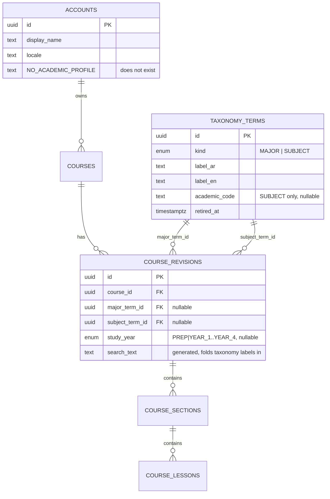
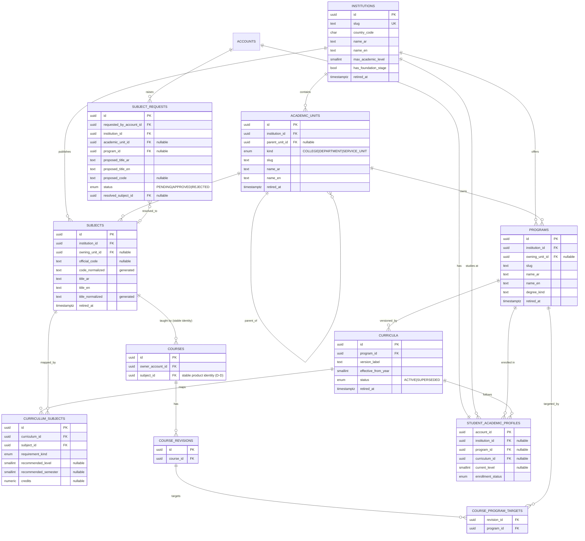

# Academic Catalog / University Taxonomy Redesign — Design & Research Report

**Date:** 2026-08-21
**Research date (all external claims):** 2026-08-21
**Status:** **Approved planning authority.** Founder decisions D-A, D-B, D-C, D-D applied 2026-08-21
and recorded canonically as [D-091](../../DECISIONS.md#d-091--gradex-adopts-an-institution-scoped-academic-catalog-and-retires-the-flat-course-taxonomy).
Revision 2 corrects the Course↔Subject ownership defect identified by D-D.
**Author seat:** product architect / domain modeller / researcher (not builder).
**Scope:** replaces the D-022 three-dimension taxonomy with a canonical academic catalog. Blocks
ST-03 (`docs/mvp/FUNCTIONAL_COMPLETION.md:202`) until resolved.

> This document proposes. It does not amend `docs/DECISIONS.md`, `docs/BUSINESS_RULES.md`,
> `docs/DOMAIN_MODEL.md`, `docs/SCREENS.md`, or `docs/mvp/FUNCTIONAL_COMPLETION.md`. Those changes
> require a founder decision recorded as a new `D-0xx`.

---

## 1. Executive Recommendation

Gradex should replace the flat two-vocabulary taxonomy (`MAJOR` / `SUBJECT` + a `study_year` enum)
with a small institution-scoped academic catalog:

```
Institution → AcademicUnit (self-referencing tree: College, Department)
            → Program → Curriculum (versioned) → CurriculumSubject → Subject
```

with three attachment points:

- **Gradex Course → exactly one Subject, held on the Course itself** (`courses.subject_id`) as stable
  commercial identity, plus **zero or more Program targets held on the CourseRevision**
  (`course_program_targets.revision_id`) as publishable audience metadata. *(D-D)*
- **Student → an academic profile** of `(institution, program, curriculum, current_level,
  enrollment_status)`, entirely nullable, never consulted for entitlement.
- **Instructor → read-only selection** from the Admin-owned catalog, with a `subject_requests`
  queue instead of implicit creation.

Nine new tables, one column change on `course_revisions`, one new join table, and the removal of
`major_term_id` / `study_year` from the Course. Curriculum versioning ships as *columns and one
active row per program*, not as a version-management workflow. Tracks, prerequisites, and degree
audit are explicitly out of scope.

The single most important structural correction: **academic level is a property of the Student and
of a curriculum mapping — never of a Subject and never of a Gradex Course.** Kuwait University
defines academic standing (`الفرقة الدراسية`) by *credits earned*, with **five** levels, and its
programs are laid out by *requirement category*, not by year. The current `study_year` enum
(`PREP`, `YEAR_1`–`YEAR_4`) is structurally wrong for the launch institution.

---

## 2. Problems in Current Gradex Taxonomy

### 2.1 The current model, reconstructed exactly

Source of truth read for this section:
`backend/internal/db/migrations/0009_course_authoring.up.sql`,
`backend/internal/db/migrations/0011_catalog_search.up.sql`,
`backend/internal/catalog/{revision,taxonomy,validation,authoring,review}.go`,
`backend/internal/httpapi/{admin_taxonomy_handlers,catalog_routes}.go`,
`backend/internal/catalogpublic/repository.go`,
`frontend/src/components/instructor/taxonomy-assignment-panel.tsx`,
`frontend/src/components/admin/taxonomy-*.tsx`,
`frontend/src/lib/api/public-catalog.ts`,
`docs/{DECISIONS,BUSINESS_RULES,DOMAIN_MODEL,SCREENS,GLOSSARY,NAVIGATION_MAP}.md`.



Behavioural facts:

- `taxonomy_terms` is **one flat table** discriminated by a `kind` enum. There is no institution,
  college, department, program, or curriculum entity anywhere in the schema.
- Classification is stored **on the revision**, not the Course, and all three fields are nullable at
  the DB level. Completeness is enforced only at submit time
  (`backend/internal/catalog/validation.go:57,72,87`).
- `study_year` is a Postgres enum: `PREP`, `YEAR_1`, `YEAR_2`, `YEAR_3`, `YEAR_4`.
- Term creation/rename/retire/delete is Admin-only
  (`catalog_routes.go:196-199`); Instructors read `GET /api/v1/taxonomy/terms` and select.
- Admin can override any revision's taxonomy via
  `PUT /api/v1/admin/courses/:id/taxonomy` with `{revision_id, major_term_id, subject_term_id}`
  (`admin_taxonomy_handlers.go:87`).
- The public catalogue accepts **only** `q` plus paging
  (`frontend/src/lib/api/public-catalog.ts:28-32`, `catalogpublic/repository.go`). Taxonomy labels
  are concatenated into a trigram search blob — there are no structured filters. This is exactly the
  `ST-03 … BACKEND_MISSING` row in the tracker.

### 2.2 Defects

| # | Defect | Evidence | Consequence |
|---|--------|----------|-------------|
| P1 | **No institution concept at all.** | Whole schema | Cannot support a second university without duplicating every Subject. Kuwait University's structure is currently an implicit universal assumption. |
| P2 | **Duplicate Subjects are structurally permitted.** `taxonomy_terms` has *no* unique constraint on label or code, and `validateTaxonomyTermInput` performs no existence check. | `0009_course_authoring.up.sql:48-62`; `catalog/taxonomy.go:361-376` | `SCREENS.md` AD12 promises a "duplicate-label validation" state that no code implements. Two Admins can create `Calculus I` and `Calculus 1` freely. |
| P3 | **`MAJOR` and `SUBJECT` are the same table with a discriminator.** A Major is an organisational/program concept; a Subject is a course-catalog identity. They have different keys, different lifecycles, and different owners. | `taxonomy_kind` enum | The "unclear distinction between Department and Major" the founder reports is encoded in the schema: neither exists, and one enum stands in for both. |
| P4 | **`academic_code` is optional, unvalidated, and unscoped.** | `taxonomy_terms_academic_code_check` | The only natural key a university actually publishes (`0410-101`) is treated as decoration. Identity falls back to a free-typed bilingual label. |
| P5 | **`study_year` is a hard 5-value enum welded to the Course.** | `0009_course_authoring.up.sql:22-28` | Wrong for Kuwait University (five *credit-derived* levels, plus a distinct non-degree status). Wrong for any program that is not four years. Makes a shared Subject like Calculus I un-modellable, because different programs place it at different points. |
| P6 | **One Course = one Major.** | `major_term_id` singular | An Instructor teaching Calculus I to five engineering programs must either pick one and mislabel, or duplicate the Course product — exactly what the founder wants to avoid. |
| P7 | **Taxonomy assignment is a separate screen from Course creation.** The Instructor panel is titled "Explicit Draft Taxonomy", requires re-selecting the Course from a dropdown, and **renders `revision_id: <uuid>` on screen**. | `taxonomy-assignment-panel.tsx:86` | This is the literal source of "Course IDs being manually searched/copied". |
| P8 | **Admin repair is a first-class workflow.** `PUT /admin/courses/:id/taxonomy` requires the Admin to supply `revision_id`, `major_term_id`, and `subject_term_id` as raw UUIDs. | `admin_taxonomy_handlers.go:16-20` | Admin taxonomy repair is designed-in rather than designed-out. |
| P9 | **No Student academic profile exists.** `accounts` has `display_name` and `locale` only. | `0002_identity_bootstrap.up.sql:24-54` | Personalised discovery is impossible today. Registration collects no academic context. |
| P10 | **No structured catalogue filters.** | `public-catalog.ts`, ST-03 row | The three dimensions exist solely to be smeared into a text-search blob. |
| P11 | **Classification lives on the revision, not the Course.** | `course_revisions.major_term_id` | Two revisions of one Course can disagree about what Subject it teaches. Catalog identity should not be revision-scoped; *content* should. |

---

## 3. External Research

All sources retrieved **2026-08-21**. Priority order followed: official university sites and
catalogs first; official regulatory sources second; competitor product behaviour last and only for
product/UX claims.

### 3.1 Kuwait University

**Colleges.** The official college index lists **16 colleges**: Education, Law, Public Health, Life
Sciences, Social Sciences, Allied Health Sciences, Science, Pharmacy, Graduate Studies, Medicine,
Arts, Dentistry, Engineering and Petroleum, Sharia and Islamic Studies, Architecture, Business
Administration.
Source: [Colleges of Kuwait University](https://www.ku.edu.kw/academic/colleges).

The official 2022–2023 student manual's table of contents enumerates a *different* set — it has no
College of Life Sciences/Social Sciences split in the same shape and lists 15 college sections.
Source: [دليل الطالب — عمادة القبول والتسجيل](https://portal.ku.edu.kw/manuals/admission/en/student_manual.pdf).
**Structural conclusion: the college list is itself versioned and mutable. It must be data, not code.**

**College of Engineering & Petroleum.** Seven departments, each awarding one B.Sc. program:
Petroleum, Computer, Industrial & Management Systems, Electrical, Chemical, Civil, Mechanical
Engineering. Source: [College of Engineering and Petroleum](https://eng.ku.edu.kw/).

**Course codes.** Kuwait University uses a four-digit subject-area prefix and a three-digit course
number joined by a dash. The Computer Engineering program page states the format explicitly and
gives examples `0612-201` and `0410-101`.
Source: [Undergraduate Program | Computer Engineering](https://engineering.ku.edu.kw/cpe/undergraduates/undergraduate-program).

The Computer Science department additionally uses an alphabetic form (`CS490`, `CS491`).
Source: [CS Undergraduate](https://www.cs.ku.edu.kw/undergraduate/).
**Conclusion: one institution can carry more than one code scheme. Code normalisation must be
format-agnostic.**

**Shared subjects — decisive.** The Electrical Engineering program's Mathematics & Basic Science
block lists, by exact code:

- `0410-101 Calculus I` (3), `0410-102 Calculus II` (3), `0410-111 Linear Algebra` (3),
  `0410-211 Calculus III` (3), `0410-240 Ordinary Differential Equation` (3)
- `0420-101 General Chemistry I` (3), `0420-105 General Chemistry I Laboratory` (1)
- `0430-101 General Physics I` (3), `0430-105 …Laboratory` (1), `0430-102 General Physics II` (3),
  `0430-107 …Laboratory` (1)

Source: [Undergraduate Program | Electrical Engineering](https://engineering.ku.edu.kw/ee/undergraduates/undergraduate-program).
The Computer Engineering page cites the identical `0410-101` prefix family for the same block.
**`0410-101` is one canonical Subject shared by at least Electrical and Computer Engineering. It must
not be duplicated per program.**

**Curriculum structure is by requirement category, not by year.** Computer Engineering's 132 credits
are grouped as General Education (15–18), Mathematics and Basic Science (27), College of Engineering
Requirements (18), Major/Core (56–69), Electives (9). Electrical Engineering is grouped identically.
Neither page assigns a course to a year.
Sources: as above (CpE, EE).

**Academic level is credit-derived, and there are five levels.** The official student manual defines
`الفرقة الدراسية` (academic standing) purely by credits completed:

| Credits completed | Standing |
|---|---|
| ≤ 29 | الفرقة الدراسية الأولى (Level 1) |
| 30 – 59 | Level 2 |
| 60 – 89 | Level 3 |
| 90 – 136 | Level 4 |
| ≥ 137 | **الفرقة الدراسية الخامسة (Level 5)** |

The same page defines `المدة الاعتيادية للتخرج` (normal time to graduate) as **eight** semesters for
≤136 credits, **nine** for 137–149, **ten** for 150–166.
Source: [دليل الطالب, §الفرقة الدراسية / §المدة الاعتيادية للتخرج](https://portal.ku.edu.kw/manuals/admission/en/student_manual.pdf).
**Conclusion: "four years" is false at Kuwait University, and level is a Student attribute computed
from credits — not a Subject attribute.**

**Department ≠ Major — proven.** The manual's per-college contents show departments containing
*several* programs:

- `قسم الرياضيات` (Mathematics Dept) → programs `رياضيات` and `الرياضيات المالية` (Financial Mathematics)
- `قسم الفيزياء` (Physics Dept) → four programs including `الفيزياء الهندسية (النظم الرقمية)` and
  `الفيزياء الهندسية (الليزر والإتصالات البصرية)`
- `قسم الإحصاء وبحوث العمليات` → `احصاء وبحوث العمليات` and `الإحصاء التطبيقي`
- `قسم الجغرافيا` → two **`مسار`** (tracks): `علم المعلومات الجغرافية` and `المعلومات التطبيقية`

Source: same manual, table of contents.
**Conclusion: Department is an organisational unit that owns one-to-many Programs; some Programs
contain Tracks. The founder's instruction not to equate them is correct.**

**Other structural facts from the manual.**

- `التخصص الرئيسي` (main major) = the course set the *competent department* deems necessary.
- `التخصص المساند` (supporting specialisation / minor) = **24 credits taken outside** the main major.
- `المتطلبات الجامعية` = university-wide general requirements.
- `نظام الطلبة غير المقيدين` / **Non-Degree Student** — a registered student with **no program**.
- `تغيير تخصص الطالب` — changing a student's major is a defined, expected regulation.
- The **College of Law operates a different academic system entirely** (`النظام الدراسي في كلية الحقوق`),
  not the credit system.

**Conclusion: within one institution, program structure, level semantics, and even the academic
system can vary by college. Nothing may be hard-coded.**

**Pre-major / undeclared at CoEP.** CoEP admission requires ≥80% in the science-track secondary
certificate plus an aptitude test; the Deanship of Admission and Registration determines sub-majors
once major conditions are met.
Source: [Admission to Kuwait University | VD Student Affairs](https://engineering.ku.edu.kw/vdsa/policy-temporary/undergraduate-fresh-admission).
**A student admitted to the college before a department is assigned genuinely exists. The model needs
a college-without-program state.**

**Major sheets are versioned.** The CS department publishes major sheets labelled **2024** and
**2018/2023**.
Source: [CS Undergraduate](https://www.cs.ku.edu.kw/undergraduate/).
Kuwait University "sets major sheets for main majors" with required and selective course groups.
Source: [Major Sheets | Kuwait University](https://css.ku.edu.kw/students/major-sheets).
**Curriculum versioning is real and observable, not speculative.**

### 3.2 Abdullah Al Salem University (AASU)

Kuwait's **second public university**, established under Law No. 76 of 4 August 2019.
Five colleges, and — critically — **the structure goes college → program with no department layer**:

1. كلية هندسة الحاسوب والنظم (Computer Engineering & Systems) — Computer Systems Engineering,
   Cybersecurity Engineering, Data Science & AI, Software Engineering
2. كلية الهندسة والطاقة (Engineering & Energy) — Energy Systems, Biomedical, Robotics &
   Mechatronics, Materials Science, Environmental & Sustainability, Agricultural
3. كلية إدارة الأعمال والريادة (Business & Entrepreneurship) — Digital Marketing, Innovation &
   Entrepreneurship, Supply Chain & Logistics
4. **كلية الدراسات التكاملية (Integrative Studies)** — a *service college* delivering the
   **Preparatory Program**: English, Arabic, mathematics, science, humanities, social sciences
5. كلية الطب والعلوم الصحية — MD in partnership with King's College London

Sources: [Colleges | AASU](https://aasu.edu.kw/colleges), [About AASU](https://aasu.edu.kw/pages/about-aasu).

**Model impact:** the Department layer must be **optional**, and a *foundation/preparatory* state must
be representable as a real academic unit that owns subjects but has no degree program.

### 3.3 American University of Kuwait (AUK)

- College of Engineering and Applied Sciences; BE in Electrical Engineering.
- **134 credit hours**; ≥30 credits must be **300-level or above**.
- **Alphanumeric code format**: `ELEG 220`, `CPEG 330`, `CPEG 210L`, `MATH 201`, `STAT 214`,
  `PHYS 115L`, `CSIS 120`, `ENGR 210`, `MGMT 201`.
- Requirements grouped as General Education / **Related Field Requirements** / Major — again, not by
  year.
- **Specialisation tracks exist inside one program**: "Power and Energy Systems" and "Electronics and
  Telecommunication Systems".

Source: [BE in Electrical Engineering — Degree Requirements](https://www.auk.edu.kw/ceas/programs/degree-programs/bachelor-of-engineering-be-in-electrical-engineering/major/degree-requirements).

**Model impact:** code scheme differs entirely from Kuwait University; "level" is expressed as a
*course-number band* rather than a student year; Track/Concentration is a real optional layer.

**Limitation:** AUK's exact class-standing credit thresholds are published in the AUK Academic
Catalog PDF, which did not yield extractable text in this pass. Not asserted here. It does not affect
the recommendation, because the model already treats level thresholds as institution-owned data.

### 3.4 Gulf University for Science and Technology (GUST)

Three colleges, with a genuine department layer:

- **College of Arts & Sciences** — five departments: Computer Science; English; Humanities and Social
  Sciences; Mass Communication and Multimedia; Mathematics and Natural Sciences
- **College of Business Administration** — four departments: Accounting; Business Administration;
  Economics and Finance; Management Information Systems
- **College of Engineering and Architecture** — civil engineering, mechanical engineering,
  architecture

Sources: [College of Arts & Sciences | GUST](https://www.gust.edu.kw/colleges/arts_sciences),
[GUST](https://www.gust.edu.kw/home).

**Model impact:** confirms the College → Department → Program shape must coexist with AASU's
College → Program shape in one schema.

### 3.5 American University of the Middle East (AUM)

- **Two colleges** — Engineering and Technology; Business Administration — **plus a Liberal Arts
  Department and an English Preparatory Program that do not sit under either college.**
- CoET: seven engineering programs (Architectural, Chemical, Civil, Computer, Electrical,
  Industrial, Mechanical) plus two technology B.Sc. programs.
- CBA: BSc Accounting, and BSc Business Administration with **four concentrations** (Finance, MIS,
  Marketing, HRM).
- BSc Mechanical Engineering: **132 credits**, grouped by requirement category
  (ME Requirements 62, General Engineering 6, Mathematics 19, Science 14–15, Liberal Arts 27–28,
  Free Electives 3). Codes are Purdue-derived: `ME 270`, `MA 165`, `PHYS 172`, `CHM 115`,
  `ENGR 131`, `CGT 163`, `MSE 230`.

Sources: [Overview | AUM](https://www.aum.edu.kw/english/about-aum/overview),
[BSc Mechanical Engineering — Degree Requirements](https://www.aum.edu.kw/english/academics/undergraduate-programs/bsc-mechanical-engineering/degree-requirements).

**Model impact:** an academic unit may hang **directly off the institution** with no parent college.
A third distinct code scheme. Concentrations again.

### 3.6 Kuwait regulatory context

Private institutions are licensed and accredited by the **Private Universities Council (PUC)**,
established 2007. As of 2025 Kuwait hosts roughly **14 universities — two public, twelve private**.
Sources: [PUC — CHEA international directory](https://www.chea.org/international-directory/general-secretariat-private-universities-council),
[Private universities in Kuwait | uniRank](https://www.unirank.org/kw/private/).

**Model impact:** the launch-relevant institution set is ~14, not hundreds. An institution table with
manual/manifest curation is entirely tractable.

### 3.7 Baims (competitor — product behaviour only)

Observed live on the public web app on 2026-08-21 (`app.baims.com`). Baims is a Kuwaiti recorded-course
platform founded 2017 serving university and high-school students in Kuwait and Saudi Arabia, with a
revenue-share instructor model.
Sources: [Baims](https://app.baims.com/), [Baims — about](https://app.baims.com/about/),
[MENAbytes — Baims seed funding](https://www.menabytes.com/baims-seed-funding/).

**Observed information architecture:**

- Browse is scoped by **country first** (a `Kuwait 🇰🇼` selector), then by segment:
  `University 🎓`, `Placement Test 🏫`, `Other courses 🎯`.
- The primary browsable object is a **Subject**, not a course. Subject cards carry:
  a **university label** ("Kuwait University"), the subject name, a **course count** ("21 Courses"),
  a rating, and a featured teacher.
- Subject URLs are **globally slugged**: `/subjects/calculusa/`, `/subjects/linearalgebra/`,
  `/subjects/calculusb/`, `/subjects/precalculus/` — the university appears as a *displayed label*,
  not as part of the subject's identity path.
- The search placeholder is literally **"Electric Circuits at Kuwait Uni"** — Subject-at-University
  is the promoted mental model.
- Instructor profiles are **cross-subject** (`/Alsafeer/` teaches Calculus A, Calculus B, Linear
  Algebra, Pre Calculus), with subscriber and view counts.
- Marketing copy repeatedly anchors on curriculum: "curriculum-aligned lessons", "specialized in your
  curriculum", "All your curriculum-aligned subjects … in one place".
- Onboarding is described as beginning with **"choose your academic level"**.

#### What Baims does well

1. **Subject is the unit of discovery, and one Subject aggregates many Instructors' courses.** The
   "21 Courses" count under one Subject is the correct shape: students shop *within* a subject.
2. **University is surfaced on every card**, so the student instantly sees relevance.
3. **Academic level leads onboarding** rather than a department/major interrogation.
4. **Instructor identity is portable across subjects**, which builds a following — directly relevant
   to Gradex's follow-up differentiator.
5. **Country-level segmentation** exists from day one, which is how they added Saudi Arabia without
   restructuring.

#### What creates ambiguity

1. **Subject slugs are global, not institution-scoped.** `/subjects/calculusa/` cannot cleanly hold
   Kuwait University's Calculus and another institution's Calculus at the same identity. The
   university on the card is a label, not a key.
2. **Subject names are vernacular, not official.** Baims sells "Calculus A" / "Calculus B"; Kuwait
   University publishes `0410-101 Calculus I` and `0410-102 Calculus II`. There is no official code
   anywhere in the public UI, so a student cannot verify that the Baims subject matches the course on
   their major sheet.
3. **No visible College/Program layer.** Discovery is University → Subject. A student cannot ask
   "what should a Computer Engineering Level 3 student be studying".
4. **No visible curriculum version.** When a major sheet changes, nothing in the product records it.

#### What Gradex should improve

1. **Scope Subject identity to the institution and anchor it on the official code** (`0410-101`),
   while still *displaying* the vernacular name students actually use. This is the single largest
   differentiator available and it is cheap.
2. **Model Program and Curriculum**, so "my major, my level" personalisation is possible — Baims
   cannot currently do this.
3. **Keep Baims' strengths verbatim**: Subject-as-browse-unit, many Courses per Subject, university
   on every card, level-first onboarding, portable Instructor identity.

**Limitation, stated plainly:** only Baims' unauthenticated public surface was observable. Their
authenticated profile-editing flow, instructor upload flow, and cross-institution duplicate handling
were not inspected; `app.baims.com` was subsequently blocked by browsing policy in this session.
Claims above are limited to what was directly observed.

---

## 4. Terminology

Canonical Gradex vocabulary. Internal domain terms on the left; the user never sees the right-hand
column's parenthetical notes.

| Term | Definition | Example | Notes |
|---|---|---|---|
| **Institution** | A degree-granting university, scoped to a country/market. | Kuwait University | Top of the tree. Owns everything below it. |
| **Academic Unit** | A named organisational unit inside an Institution. Kind is `COLLEGE`, `DEPARTMENT`, or `SERVICE_UNIT`. Self-nesting. | College of Engineering & Petroleum; Computer Engineering Department; College of Integrative Studies (AASU) | One table, not three. Depth is data. |
| **Program** | The degree specialisation a Student follows. | B.Sc. Computer Engineering | What the Student picks. Owned by an Academic Unit. |
| **Track / Concentration** | Optional specialisation inside one Program. | AUK "Power and Energy Systems"; KU `مسار المعلومات التطبيقية` | **Post-launch. Not in MVP.** |
| **Curriculum** | A versioned academic plan / major sheet for one Program. | Computer Science Major Sheet 2024 | One `ACTIVE` per Program at MVP. |
| **Curriculum Subject** | The relationship between a Curriculum and a Subject. | `0410-101` is a Mathematics-and-Basic-Science requirement of CpE 2026, recommended level 1 | Carries requirement kind, recommended level/semester, credits. |
| **Subject** | The Institution's canonical academic course identity. | `0410-101 — Calculus I` | **Not** a Gradex product. Institution-scoped. |
| **Gradex Course** | The commercial learning product an Instructor builds to teach one Subject. | "Calculus I — Full Semester Review, by م. X" | Many Courses may teach one Subject. |
| **Academic Level** | A Student's current standing at their Institution. | Level 3 | Integer, institution-defined bounds. Never on a Subject. |
| **Enrollment Status** | Whether the Student has a declared Program. | `ENROLLED` / `UNDECLARED` / `FOUNDATION` / `NON_DEGREE` | Sourced from real KU/AASU states. |

Deliberately **retired** terms: `Major term`, `Subject term`, `Taxonomy Term`, `Study Year`,
`taxonomy assignment`.

---

## 5. Recommended Academic Hierarchy

```
Country / Market (ISO code on Institution — not its own table)
└── Institution                       (Kuwait University)
    └── AcademicUnit  [tree]          (College of Engineering & Petroleum)
        └── AcademicUnit              (Computer Engineering Department)   ← optional level
            └── Program               (B.Sc. Computer Engineering)
                └── Curriculum        (CpE Plan 2026)         ← versioned
                    └── CurriculumSubject  ──── m:n ────► Subject   (0410-101 Calculus I)
                                                            ▲
                                                            │ exactly one
                                                    Gradex Course
                                                            │ zero or more
                                                            ▼
                                                    Program targets
```

**Why this shape and not `University → Department → Year → Subject`:**

- `Department` is not universal. AASU has none; AUM has departments outside colleges. A
  self-referencing `academic_units` tree absorbs all four observed shapes with one table.
- `Year` is not structural anywhere researched. Kuwait University derives level from credits, with
  five bands; AUK expresses level as a course-number band; every program surveyed groups courses by
  requirement category. Year belongs on the Student and (as a *recommendation*) on the
  Curriculum-Subject edge.
- `Subject` cannot hang off a Department, because `0410-101` (Mathematics) is required by Electrical
  *and* Computer Engineering. It hangs off the **Institution**, with an optional owning unit for
  display.
- `Curriculum` between Program and Subject is what makes the many-to-many both correct and versioned,
  and is the only place recommended level can honestly live.

---

## 6. ER Model



---

## 7. Subject Identity & Deduplication

**Natural key: `(institution_id, code_normalized)` when a code exists; `(institution_id,
title_normalized)` when it does not.**

Normalisation:

- `code_normalized` = uppercase, strip every character that is not `[A-Z0-9]`.
  `0410-101` → `0410101`; `CS 490` → `CS490`; `ELEG 220` → `ELEG220`. This absorbs all three observed
  code schemes without knowing which one an institution uses.
- `title_normalized` = the **existing** `catalog_normalize_ar()` function from
  `0011_catalog_search.up.sql` applied to `coalesce(title_ar,'') || ' ' || coalesce(title_en,'')`.
  Reusing it is deliberate: Arabic folding rules are already decided under D-023 and must not fork.

Constraints:

```sql
CREATE UNIQUE INDEX subjects_institution_code_unique
    ON subjects (institution_id, code_normalized)
    WHERE code_normalized IS NOT NULL AND retired_at IS NULL;

CREATE UNIQUE INDEX subjects_institution_title_unique
    ON subjects (institution_id, title_normalized)
    WHERE code_normalized IS NULL AND retired_at IS NULL;
```

Rules:

1. **Instructors never insert a `subjects` row.** Only Admin, via catalog management or by approving a
   `subject_requests` row.
2. Creation is **fail-closed on conflict**: a duplicate code or duplicate code-less title returns
   `409` with the existing Subject attached, so Admin picks the existing one rather than creating a
   near-miss. This is the missing behaviour that `SCREENS.md` AD12 already promises as
   "duplicate-label validation".
3. Retirement is soft (`retired_at`). Retired Subjects are excluded from the unique indexes so a code
   can legitimately be reissued, are unselectable for new Courses, and stay resolvable for existing
   Courses — preserving the current BR-160 semantics.
4. A Subject carries **both** an Arabic and an English title plus the official code. Display shows the
   code alongside the localised title (`0410-101 · حساب التفاضل والتكامل ١`), which is the concrete
   improvement over Baims' code-free vernacular naming.
5. Near-duplicate detection at Admin creation time is **advisory**: a trigram similarity search over
   `title_normalized` warns but does not block, because `Calculus I` and `Calculus II` are legitimately
   similar.

---

## 8. Curriculum / Major Sheet Model

`curricula` + `curriculum_subjects` is the many-to-many between Program and Subject.

- `curricula(program_id, version_label)` unique. `version_label` is the university's own label
  ("2024", "2018/2023" — both observed on the KU CS department site).
- Exactly one `ACTIVE` curriculum per Program is enforced by a partial unique index. Older ones become
  `SUPERSEDED` and are never rewritten or deleted.
- `curriculum_subjects` carries `requirement_kind` (`UNIVERSITY_REQUIREMENT`, `COLLEGE_REQUIREMENT`,
  `MAJOR_CORE`, `MAJOR_ELECTIVE`, `SUPPORTING`, `FREE_ELECTIVE`) — these map directly onto the observed
  KU/AUK/AUM category groupings and onto KU's `المتطلبات الجامعية` / `التخصص الرئيسي` /
  `التخصص المساند`.
- `recommended_level` and `recommended_semester` are **nullable smallints, not enums**. Null means
  "the plan does not fix a position", which is the honest default for a credit-hour system.
- `credits` is nullable metadata. No degree-audit logic is built on it.

**MVP versus future.** The *tables and version columns* ship in MVP because retrofitting them is
expensive and the KU CS department already publishes two live versions. The *workflow* — creating a
new version, diffing versions, migrating students between versions — is post-launch. At MVP a
Curriculum is created once per Program by the catalog importer and edited in place.

A Student's profile stores `curriculum_id` **as resolved at onboarding**, not derived at query time.
When a new curriculum is published, existing Students keep the version they were on until they
explicitly change it. This is what "existing Courses and Students remain interpretable" requires.

---

## 9. Academic Level Model

**Decision: `Student.current_level` and `CurriculumSubject.recommended_level` are separate, and
neither Subject nor Gradex Course carries a level.**

Evidence: Kuwait University defines `الفرقة الدراسية` by credits earned across **five** bands and
defines normal time-to-graduate as 8, 9, or 10 semesters depending on credit count; AUK expresses
level as a 300+ course-number band; every surveyed program groups courses by requirement category
rather than year.

Representation:

- `institutions.max_academic_level smallint` — 5 for Kuwait University, institution-specific
  elsewhere.
- `institutions.has_foundation_stage bool` — true for AASU (College of Integrative Studies preparatory
  program) and AUM (English Preparatory Program).
- `student_academic_profiles.current_level smallint NULL`, valid range `1 .. institution.max_academic_level`.
- `student_academic_profiles.enrollment_status`:
  - `ENROLLED` — has a Program.
  - `UNDECLARED` — admitted to a college, Program not yet assigned (the real KU CoEP pre-major state).
  - `FOUNDATION` — in a preparatory/foundation program (AASU, AUM).
  - `NON_DEGREE` — Kuwait University's `الطالب غير المقيد` / Non-Degree Student.
- `curriculum_subjects.recommended_level smallint NULL`.

The existing `study_year` enum and `course_revisions.study_year` column are **removed**. Level in the
catalogue is computed, not stored on the product:

```
course is level-relevant to student S
  ⟺ ∃ cs ∈ curriculum_subjects
        WHERE cs.curriculum_id = S.curriculum_id
          AND cs.subject_id    = course.subject_id
          AND cs.recommended_level = S.current_level
```

This is why the same Calculus I Course correctly surfaces at whatever level each program places it.

---

## 10. Student Academic Profile

One row per account, all academic columns nullable.

```
student_academic_profiles(
    account_id           UUID PK REFERENCES accounts(id),
    institution_id       UUID NULL REFERENCES institutions(id),
    program_id           UUID NULL REFERENCES programs(id),
    curriculum_id        UUID NULL REFERENCES curricula(id),
    current_level        SMALLINT NULL,
    enrollment_status    enrollment_status NOT NULL DEFAULT 'UNDECLARED',
    completed_at         TIMESTAMPTZ NULL,
    created_at, updated_at
)
```

Rules:

1. **The profile is discovery-only.** It is never read by entitlement, access-grant, purchase, or
   playback code paths. This is an invariant (I-17, I-18) and must have a dedicated regression test.
2. `program_id` requires `institution_id`, and the Program must belong to that Institution.
3. `curriculum_id` is resolved server-side from the Program's `ACTIVE` curriculum at save time; the
   client never supplies it.
4. `current_level` is bounded by `institutions.max_academic_level`.
5. Changing any field is a plain update. There is **no** cascade to entitlements, purchases, progress,
   or invitations. Changing Major re-ranks the catalogue and nothing else.
6. `completed_at` distinguishes "never onboarded" from "deliberately skipped", so the prompt can be
   shown once and then respected.

---

## 11. Student Onboarding UX

**Placement: after email verification, on first authenticated entry — skippable, resumable, never
blocking.** Not during registration (adds four fields to a conversion-critical form), not optional-
forever (nobody completes it).

Cascading selectors, each dependent on the previous, server-validated:

```
Step 1  University        [ جامعة الكويت ▾ ]         ← required to continue
Step 2  College           [ كلية الهندسة والبترول ▾ ]  ← filtered to that University
Step 3  Program/Major     [ هندسة الحاسوب ▾ ]         ← filtered to that College's units
        └ "لم أحدد تخصصي بعد"  → enrollment_status = UNDECLARED, skip to Step 4
Step 4  Academic Level    [ المستوى ٣ ▾ ]             ← 1..max_academic_level for that University
                                                        + "سنة تأسيسية" if has_foundation_stage
[ تخطي الآن ]                              [ حفظ ]
```

**Department is deliberately not asked.** It is derivable from the Program's `owning_unit` ancestry.
Asking for it adds a step whose only possible effect is producing invalid combinations — precisely
the founder's concern.

**College is asked**, even though it is also derivable from the Program, for one reason: it makes the
Program list short and readable. At Kuwait University, the unfiltered undergraduate program list is
long; filtered to one college it is 5–7 items. College is a *filter affordance*, not a stored fact —
it is not persisted on the profile.

Impossible combinations are prevented twice: the client only ever renders children of the selected
parent, and `PUT /me/academic-profile` re-validates the whole tuple server-side and returns
`422 VALIDATION_FAILED` with a `PROGRAM_NOT_IN_INSTITUTION` violation if it does not hold.

**Invitation-based Students.** A Student arriving via a Course invitation or access grant proceeds
straight to accept/redeem. The onboarding prompt appears afterwards, on the next catalogue visit.
Onboarding state must never gate an access-grant flow — this is invariant I-18.

**Changing the profile later.** Same component, reached from the Student profile screen. Explicit copy:
"تغيير تخصصك يغيّر ترتيب الكتالوج فقط. دوراتك ومشترياتك لا تتأثر." ("Changing your major only changes
how the catalogue is ordered. Your courses and purchases are unaffected.")

---

## 12. Instructor Course Creation UX

Today: create a Course with a title, then go to a *different* panel, re-pick the Course from a
dropdown, and read a raw `revision_id` off the screen. That is deleted.

Replacement — one guided create flow, academic context first:

```
"أنشئ دورة جديدة"

Step 1  الجامعة        [ جامعة الكويت ▾ ]
Step 2  المادة         [ ابحث بالرمز أو الاسم…            ]
                       ┌─────────────────────────────────┐
                       │ 0410-101 · Calculus I           │
                       │   كلية العلوم — قسم الرياضيات    │
                       │   مطلوبة في: هندسة الحاسوب،      │
                       │   هندسة كهربائية، +3             │
                       └─────────────────────────────────┘
                       [ لم أجد مادتي — اطلب إضافتها ]

Step 3  Gradex shows, read-only, derived from curriculum mappings:
        "تُدرَّس عادةً في المستوى ١"
        "الطلاب المستهدفون: هندسة الحاسوب، هندسة كهربائية، هندسة ميكانيكية، …"
        [ تخصيص الجمهور ]   ← optional, opens the Program multi-select

Step 4  العنوان بالعربية / English title
        [ إنشاء الدورة ]
```

**Subject is selected before Program, not after.** This is the reverse of the founder's draft order,
and the research supports the reversal: an Instructor knows the subject they teach (`0410-101`)
before they know its full audience, and the curriculum mappings can *derive* the audience for them.
Asking for College → Program → Subject would force a Calculus instructor to pick one program
arbitrarily before reaching the subject, reproducing defect P6.

A single searchable Subject picker, scoped by Institution and matching on **code or either title**,
replaces the College/Department drill-down entirely. The College/Department shown under each result is
context, not a selection step.

**No UUID ever appears in Instructor UI.** Courses are addressed by title in lists and by slug in
URLs. The `revision_id` line at `taxonomy-assignment-panel.tsx:86` is deleted along with the panel.

---

## 13. Missing Subject Request Flow

```
Instructor: [ لم أجد مادتي — اطلب إضافتها ]
    ↓
Form, pre-filled from the current context:
    University        (pre-filled, locked)
    College           (optional dropdown)
    Program           (optional dropdown, filtered by College)
    Subject name — Arabic       (required)
    Subject name — English      (required)
    Official code               (optional, hint: "مثال: 0410-101")
    Note to the Admin           (optional)
    ↓
POST /api/v1/instructor/subject-requests    → 201, status PENDING
    ↓
Instructor sees a PENDING chip in the Course create flow and can continue drafting the
Course *without* a Subject. The Course simply cannot be submitted for review until a
Subject is attached — the same gate that exists today in validation.go.
    ↓
Admin queue: AD13 "طلبات إضافة مواد"
    ├─ [ اعتماد كمادة جديدة ]   → creates the Subject, links resolved_subject_id,
    │                              auto-attaches it to the requesting Instructor's draft
    ├─ [ ربط بمادة موجودة ]     → picks an existing Subject (the dedupe path)
    └─ [ رفض ]                  → requires a reason, shown to the Instructor
    ↓
Instructor is notified; the draft's Subject is now set and submission unblocks.
```

The Instructor gains **zero** taxonomy write authority. `subject_requests` is a proposal table with no
foreign key into `subjects` until an Admin resolves it. This is the mechanism that makes
"Instructor must not create Subjects freely" enforceable rather than aspirational.

---

## 14. Admin Academic Catalog

A **new Admin section, separate from Course review**. Course review keeps its own queue and never
touches taxonomy.

```
AD12 — الكتالوج الأكاديمي  (replaces "Catalog Taxonomy")
├── الجامعات                          list · create · edit · retire
│   └── جامعة الكويت
│       ├── الكليات والأقسام          tree view · create · rename · re-parent · retire
│       ├── التخصصات (Programs)       list · create · edit · retire · set owning unit
│       │   └── هندسة الحاسوب
│       │       └── الخطة الدراسية     the ACTIVE curriculum
│       │           └── المواد         add/remove Subject · requirement kind ·
│       │                              recommended level · semester · credits
│       └── المواد (Subjects)         list · search by code/title · create · edit ·
│                                     retire · "used by N Courses" · "in M curricula"
└── طلبات إضافة المواد  [3]           the AD13 request queue

AD10 — مراجعة الدورات   (unchanged; no taxonomy controls)
```

Capabilities: view, create, edit, retire (soft), map Subject↔Curriculum with level/semester, bulk
import, and resolve Instructor requests.

**Removed:** `PUT /api/v1/admin/courses/:id/taxonomy`. Admin no longer repairs a Course's Subject by
UUID. If a Course is on the wrong Subject, the Admin uses the ordinary review path — request changes
with a reason, and the Instructor re-picks from a catalog that now contains the right Subject. The
repair endpoint existed only because the catalog was unreliable; fixing the catalog removes the need.

If an escape hatch proves necessary in operation, it should be re-introduced as a Course-scoped
action on the review screen ("change Subject", with a Subject picker and a mandatory reason) — never
as a raw-identifier form.

---

## 15. Gradex Course ↔ Subject ↔ Program Relationship

**Recommendation: Option B, with ownership split by lifetime (D-D).**

```
Course          └─ subject_id                stable academic / commercial identity
CourseRevision  └─ course_program_targets    publishable audience override
```

`courses.subject_id` is mandatory before first submission for review. Program targets are
revision-scoped, optional, and default to "every Program whose applicable active Curriculum maps the
Course Subject" (D-B).

| Option | Verdict | Reasoning |
|---|---|---|
| **A — Subject only** | Rejected | Audience is then *entirely* derived from curriculum mappings. Correct in the common case, but an Instructor who builds "Calculus I for Engineers" specifically cannot say so, and a Subject required by 12 programs surfaces the Course to all 12 with no way to narrow it. |
| **B — Subject + Program targets** | **Recommended** | One Subject gives a stable, code-anchored identity that survives curriculum changes. Program targets, defaulted from `curriculum_subjects` and overridable, give the Instructor audience control without duplicating the product. Empty target set = "all programs that map this Subject", so the common case needs no input. |
| **C — CurriculumSubject** | Rejected | Binds a *commercial product* to a *curriculum version*. When Kuwait University publishes CpE Plan 2027, every Course pointing at a 2026 `curriculum_subjects` row becomes stale or needs rewriting. Violates "Course remains understandable after curriculum version changes". |
| **D — free hybrid** | Rejected | Any model where a Course may reference either a Subject or a CurriculumSubject doubles every query and every invariant for no product gain. |

Against the stated requirements:

- *Same Subject shared across programs* — yes, via `curriculum_subjects` m:n. Calculus I is one row.
- *Discovery by Student academic profile* — yes: `student.curriculum_id → curriculum_subjects →
  subject_id → courses.subject_id`, with the live revision's `course_program_targets` narrowing when
  present.
- *Understandable after curriculum version change* — yes: the Course points at `subjects.id`, which
  no curriculum revision touches.
- *No impossible combinations* — enforced by I-9 and I-10: a Program target must share the Subject's
  Institution.
- *Straightforward Admin review* — the reviewer sees "Subject: 0410-101 Calculus I · Targets:
  CpE, EE, ME" as plain text; no identifiers.
- *Future universities* — every relationship is Institution-scoped.

**No Course duplication is ever required.** One Calculus I Course serves every engineering program
that maps `0410-101`.

### 15.1 Course Subject lifecycle (D-D)

`courses.subject_id` is **product identity**, not content. A Course teaching `0410-101 · Calculus I`
must not silently become `Computer Networks` because a new content revision was published — that is a
different Gradex Course, not a revision.

**Before first publication**

- `subject_id` may be `NULL` while the Instructor is drafting or a missing-Subject request is
  unresolved. Drafting is never blocked by an absent Subject.
- The owning Instructor may set or change it while they own the Course, the Course has never been
  published, and the Course lifecycle is still editable (`DRAFT` / `CHANGES_REQUESTED`).
- **Submission for review requires `courses.subject_id IS NOT NULL`** and the referenced Subject must
  be active and eligible. This preserves the existing submit-time gate, moved from the revision to
  the Course.

**After first publication**

- `subject_id` is immutable through ordinary authoring.
- New candidate revisions inherit it implicitly; there is no per-revision Subject that could diverge.
- **No ordinary revision mutation exposes a Subject field.** The Instructor authoring API has no path
  to change it.

**Exceptional post-publication correction — documented, not implemented**

Not built in T1, and not built by any currently authorized tranche. If a genuine misclassification is
discovered after publication, any correction must be explicit, privileged, audited, Course-scoped,
reason-required, and must never be a raw-UUID repair form. That workflow may be designed later if
operations prove it necessary. **For MVP ordinary authoring, a published Course's Subject is
immutable.**

**Why Program targets stay revision-scoped**

Audience targeting is publishable metadata. It may legitimately change through
candidate revision → Admin approval → live revision without changing what the Course teaches.
`course_program_targets` therefore keys on `revision_id`, and follows the existing revision review
and publication lifecycle exactly like every other publishable field.

---

## 16. Catalogue Discovery / Future ST-03

**Not implemented in this pass.** Design only, so ST-03 can be built against a correct model.

Default catalogue for a Student with a complete profile, ranked in tiers:

1. Courses whose Subject is in **my curriculum at my current level**
2. Courses whose Subject is in **my curriculum at any level**
3. Courses whose Subject is in **any curriculum at my institution**
4. Everything else, `PUBLISHED`

Within a tier, D-023 relevance ranking applies unchanged when `q` is present.

Filter order and dependencies — each depends only on the one above it:

```
University  (independent; defaults to profile, always changeable)
  └ College       (optional; filters Programs)
      └ Program   (optional; filters Subjects via the ACTIVE curriculum)
          └ Level (optional; filters via curriculum_subjects.recommended_level)
Subject     (independent; searchable within the selected University)
```

Rules:

- **A Student can always browse outside their profile.** Every filter is clearable; clearing
  University returns the unpersonalised global catalogue.
- Level is only offered once a Program is chosen, because `recommended_level` is meaningless without
  a curriculum.
- A Student with no profile sees today's behaviour exactly: search plus paging, no personalisation.
  This is the compatibility guarantee for ST-03.
- Filters are exact-match, composable with `q`, and never expose unpublished Courses — preserving
  BR-161.
- Filter option lists are served from a **public, read-only** projection that exposes only
  `id`, `slug`, and localised names. No Admin fields, no retired rows, no counts that could leak
  unpublished content.

---

## 17. Existing User Migration

Non-destructive and trivially reversible.

1. `CREATE TABLE student_academic_profiles` with every academic column nullable and
   `enrollment_status DEFAULT 'UNDECLARED'`.
2. **No backfill.** No row is created for existing accounts. Absence of a row means "not onboarded".
3. All read paths treat a missing profile as "no personalisation" and fall through to the current
   global catalogue behaviour.
4. Onboarding is prompted on next authenticated catalogue visit and is skippable.
5. Existing E2E fixtures and seeded accounts continue to pass unchanged, because no assertion in the
   current suite reads an academic profile.

Rollback: drop the table. Nothing else references it.

---

## 18. Existing Course/Taxonomy Migration

This is the highest-risk tranche and it is **not** hand-waved.

### 18.1 What actually exists

There is **no seeded taxonomy anywhere in the repository** — no `taxonomy_terms` inserts in
`backend/cmd/e2e-seed/`, `backend/internal/entitlement/seed_nonprod.go`, or any migration. Every
`taxonomy_terms` row in any environment was created by an Admin at runtime or by an E2E fixture. The
migration corpus is therefore small and enumerable, not a bulk data problem.

### 18.2 Mapping strategy

| Old | New | Automatable? |
|---|---|---|
| `taxonomy_terms` where `kind='SUBJECT'` with a non-null `academic_code` | `subjects` row under the launch Institution, `official_code` = the code | **Yes** — deterministic |
| `taxonomy_terms` where `kind='SUBJECT'` with a null `academic_code` | `subjects` row, code null, dedupe on `title_normalized` | **Yes**, but collisions must be reported |
| `taxonomy_terms` where `kind='MAJOR'` | Candidate `programs` row | **No** — requires founder review; "Major" was free vocabulary and may hold a college name, a department name, or a program name |
| `course_revisions.subject_term_id` | **`courses.subject_id`** (collapsed to the Course; D-D) | **Yes** when every revision of a Course agrees. **No** where revisions of one Course disagree — that is an ambiguity-report row for founder resolution |
| `course_revisions.major_term_id` | `course_program_targets` row(s) | **No** — one-to-one only if the Major term resolves cleanly to exactly one Program |
| `course_revisions.study_year` | **Dropped.** Recorded in the migration report for reference | N/A — no destination; level moves to profile + curriculum |

### 18.3 Ambiguity report (produced before any write)

A read-only `cmd/catalog-migrate --report` run emits, per environment:

- Subject terms with no `academic_code` → require a founder-supplied code or an explicit
  "code-less, keep title identity" decision.
- Subject terms whose normalised titles collide → must be merged to one Subject; every referencing
  Course listed.
- Every distinct `MAJOR` term with its referencing Course count → founder maps each to a Program, a
  College, or `DROP`.
- Courses with a `study_year` that no curriculum mapping reproduces → informational only.
- Courses that would end with zero Program targets → expected and fine (means "all programs mapping
  this Subject").

### 18.4 Execution order

1. Ship the new tables **additively**. `course_revisions` gains a nullable `subject_id`.
   `subject_term_id`, `major_term_id`, and `study_year` are untouched and still authoritative.
2. Import the launch Institution catalog from the version-controlled manifest.
3. Run `--report`; founder resolves the ambiguity list into a checked-in mapping file.
4. Run `--apply`, which is idempotent and writes `subject_id` and `course_program_targets` only.
5. Read paths switch to `subject_id` behind a config flag, with the old columns still populated.
6. Prove the full public/purchase/access E2E green against the new path.
7. **Only then**, in a separate later migration, drop `major_term_id`, `study_year`,
   `subject_term_id`, the `study_year` enum, the `taxonomy_kind` enum, and `taxonomy_terms`.

### 18.5 Rollback

Steps 1–5 are reversible by flipping the flag back; the old columns are still populated and no data
was destroyed. Step 7 is the point of no return and must not be in the same tranche as step 1.

### 18.6 E2E protection

`frontend/e2e/s3-public-catalogue.spec.ts`, `s12-instructor-authoring.spec.ts`,
`s14-admin-catalog-review.spec.ts`, `s15-protected-materials.spec.ts`, and
`s2-taxonomy-viewport.spec.ts` all touch taxonomy. Each must be updated in the same tranche as the
surface it covers, and each must stay green. `s2-taxonomy-viewport.spec.ts` asserts the heading
"Explicit Draft Taxonomy" / "تصنيف المسودة المحددة", which the redesign deletes — that spec is rewritten,
not deleted.

---

## 19. API Proposal

No raw taxonomy CRUD is ever public. Three audiences, three surfaces.

### Public / onboarding

| Method | Path | Notes |
|---|---|---|
| `GET` | `/api/v1/academic/institutions` | Active only. `{id, slug, name, country_code, max_academic_level, has_foundation_stage}` |
| `GET` | `/api/v1/academic/institutions/:id/units?kind=COLLEGE` | Colleges of one institution |
| `GET` | `/api/v1/academic/institutions/:id/programs?unit_id=` | Programs, optionally filtered by owning unit ancestry |
| `GET` | `/api/v1/academic/institutions/:id/levels` | Derived list `1..max_academic_level` + foundation flag |
| `GET` | `/api/v1/academic/subjects?institution_id=&q=` | Public, read-only, active only; matches code or either title |
| `GET` | `/api/v1/me/academic-profile` | Authenticated Student |
| `PUT` | `/api/v1/me/academic-profile` | Full-tuple server-side validation; resolves `curriculum_id` |
| `DELETE` | `/api/v1/me/academic-profile` | Clears personalisation; never touches entitlement |

Catalogue (extends the existing endpoint, additive):

| Method | Path |
|---|---|
| `GET` | `/api/v1/catalog/courses?q=&institution_id=&program_id=&level=&subject_id=&page=` |

### Instructor

| Method | Path | Notes |
|---|---|---|
| `GET` | `/api/v1/instructor/academic-context?institution_id=` | Institutions + subject search scope for the create flow |
| `GET` | `/api/v1/instructor/subjects?institution_id=&q=` | Canonical Subjects; each result carries derived `recommended_levels[]` and `target_programs[]` |
| `POST` | `/api/v1/courses` | Now accepts `subject_id` and optional `program_target_ids[]` at creation |
| `PATCH` | `/api/v1/courses/:id/revisions/:revisionId` | Accepts `subject_id`, `program_target_ids[]` |
| `POST` | `/api/v1/instructor/subject-requests` | Creates a PENDING request |
| `GET` | `/api/v1/instructor/subject-requests` | Own requests only |

**Removed:** `PUT /api/v1/courses/:id/taxonomy` (Instructor) and the standalone taxonomy panel it fed.

### Admin

| Method | Path |
|---|---|
| `GET POST` | `/api/v1/admin/academic/institutions` |
| `PATCH POST` | `/api/v1/admin/academic/institutions/:id` · `/retire` |
| `GET POST` | `/api/v1/admin/academic/institutions/:id/units` |
| `PATCH POST` | `/api/v1/admin/academic/units/:id` · `/retire` |
| `GET POST` | `/api/v1/admin/academic/institutions/:id/programs` |
| `PATCH POST` | `/api/v1/admin/academic/programs/:id` · `/retire` |
| `GET` | `/api/v1/admin/academic/programs/:id/curriculum` |
| `PUT DELETE` | `/api/v1/admin/academic/curricula/:id/subjects/:subjectId` |
| `GET POST` | `/api/v1/admin/academic/institutions/:id/subjects` |
| `PATCH POST` | `/api/v1/admin/academic/subjects/:id` · `/retire` |
| `POST` | `/api/v1/admin/academic/institutions/:id/import` |
| `GET` | `/api/v1/admin/academic/subject-requests?status=PENDING` |
| `POST` | `/api/v1/admin/academic/subject-requests/:id/approve` · `/link` · `/reject` |

**Removed:** `POST|PATCH|DELETE /api/v1/admin/taxonomy/terms*` and
`PUT /api/v1/admin/courses/:id/taxonomy`.

Every Admin mutation writes an audit event exactly as the current taxonomy mutations do
(`writeTaxonomyAudit` in `catalog/taxonomy.go`), preserving BR-158's audit guarantee.

---

## 20. Domain Invariants

Server-enforced. DB constraint where possible; application check where a constraint cannot express it.

**Structure**

- **I-1** An `academic_unit`'s `parent_unit_id`, when set, must belong to the same `institution_id`.
- **I-2** The academic-unit graph is acyclic; a unit may not be its own ancestor.
- **I-3** A `program.owning_unit_id`, when set, must belong to `program.institution_id`.
- **I-4** A `curriculum` belongs to exactly one `program`. At most one curriculum per program has
  `status='ACTIVE'` (partial unique index).
- **I-5** `curriculum_subjects.subject_id` must reference a Subject whose `institution_id` equals the
  curriculum's program's `institution_id`. *(Cross-institution mapping is impossible.)*
- **I-6** `(curriculum_id, subject_id)` is unique — a Subject appears at most once in one curriculum.
- **I-7** `curriculum_subjects.recommended_level`, when set, must be within
  `1 .. institution.max_academic_level`.

**Subject identity**

- **I-8** `(institution_id, code_normalized)` is unique among non-retired Subjects with a code;
  `(institution_id, title_normalized)` is unique among non-retired Subjects without one.
- **I-9** A retired Subject cannot be newly assigned to a Course or newly added to a curriculum, but
  existing references remain resolvable and existing Courses remain publishable.
- **I-10** A Subject with at least one referencing Course or curriculum mapping may be retired but not
  deleted.

**Course**

- **I-11** `courses.subject_id` must be non-null and reference a non-retired Subject before any
  revision of that Course may enter `PENDING_REVIEW`. *(Preserves today's submit-time gate at the
  Course level.)*
- **I-12** Every `course_program_targets.program_id` must belong to the same Institution as the
  revision's Subject.
- **I-13** **A Course's Subject is immutable once the Course has been published.** Before first
  publication the owning Instructor may set or change it while the Course is editable; it may never
  change while a revision is in `PENDING_REVIEW`. Ordinary revision mutations expose no Subject
  field. *(D-D)*
- **I-13a** New candidate revisions of a published Course inherit the Course Subject implicitly,
  because the relationship is Course-level. There is no per-revision Subject to diverge.
- **I-14** An empty `course_program_targets` set means "every Program whose ACTIVE curriculum maps
  this Subject" — it is never interpreted as "no audience".

**Student profile**

- **I-15** `program_id` requires `institution_id`, and the Program must belong to that Institution.
- **I-16** `current_level`, when set, must be within `1 .. institution.max_academic_level`.
- **I-17** `curriculum_id` is server-resolved from the Program's ACTIVE curriculum; a client-supplied
  value is rejected.
- **I-18** **No entitlement, access grant, purchase, enrollment, invitation, or media-playback
  decision may read `student_academic_profiles`.** Changing or clearing the profile has no effect on
  access. This requires an explicit regression test.
- **I-19** Completing or skipping onboarding never blocks accepting a Course invitation or redeeming
  an access grant.

**Authority**

- **I-20** Only an Admin principal may insert, update, or retire rows in `institutions`,
  `academic_units`, `programs`, `curricula`, `curriculum_subjects`, or `subjects`.
- **I-21** A `subject_requests` row never creates a `subjects` row implicitly; only an explicit Admin
  approve/link action does, and the request records who approved it and when.
- **I-22** Public and Instructor read endpoints expose only non-retired rows and only the public
  projection fields.

---

## 21. Localization Vocabulary

User-facing Arabic chosen for Kuwaiti undergraduates, not for literal accuracy. Domain jargon
(`taxonomy`, `term`, `revision`, `curriculum_subject`) is never rendered.

| Concept | English (UI) | Arabic (UI) | Official/formal alternative | Choice rationale |
|---|---|---|---|---|
| Institution | University | **الجامعة** | — | Universal. |
| College | College | **الكلية** | — | Matches every Kuwaiti institution's own usage. |
| Department | Department | **القسم** | — | Shown as context only; never a selection step. |
| Program / Major | Major | **التخصص** | البرنامج | `التخصص` is what Kuwaiti students say and what the KU manual uses (`التخصص الرئيسي`). `البرنامج` reads administrative. |
| Track | Track | **المسار** | التركيز | Post-launch. `المسار` is KU's own word (`مسار المعلومات التطبيقية`). |
| Curriculum | Study plan | **الخطة الدراسية** | الخطة الأكاديمية / صحيفة التخصص | Students recognise "الخطة الدراسية". "صحيفة التخصص" (major sheet) works as a secondary label in Admin. |
| Academic Level | Level | **المستوى الدراسي** | الفرقة الدراسية | `المستوى` is the everyday word; `الفرقة الدراسية` is KU's regulation term and belongs in a tooltip, not a label. |
| Subject | Subject | **المادة** | المقرر | **D-A APPROVED.** `المادة` is the primary product-facing term; `المقرر` may appear secondarily where official university terminology helps. |
| Gradex Course | Course | **الكورس** | الدورة | **D-A APPROVED.** `الكورس` is the primary Student/Instructor product term. `الدورة` is superseded. |
| Foundation stage | Foundation | **السنة التأسيسية** | البرنامج التحضيري | Matches AASU/AUM preparatory framing. |
| Undeclared | Undeclared | **لم أحدد تخصصي بعد** | غير محدد | Phrased as the student's own statement. |
| Non-degree | Non-degree | **طالب غير مقيد** | — | KU's own official term. |
| Subject request | Request a subject | **اطلب إضافة مادة** | — | Action-phrased. |

Terms that must **never** appear in UI: taxonomy / تصنيف, term / مصطلح, revision ID, any UUID.

**Rollout rule (D-A).** The decision is recorded canonically now. Copy changes are applied **only on
surfaces a tranche actually touches**. No unrelated global copy rewrite is performed, and no tranche
is widened merely to propagate vocabulary.

---

## 22. Security / Permissions

| Entity | Create | Edit | Retire | Read |
|---|---|---|---|---|
| Institution | Admin | Admin | Admin | Public |
| AcademicUnit | Admin | Admin | Admin | Public |
| Program | Admin | Admin | Admin | Public |
| Curriculum | Admin | Admin | Admin | Admin + derived public projection |
| CurriculumSubject | Admin | Admin | Admin | Admin + derived public projection |
| Subject | Admin | Admin | Admin | Public |
| Course ↔ Subject link | **Instructor** (own Course, from catalog) | Instructor (own, pre-review) | — | Public once published |
| Course ↔ Program targets | **Instructor** (own Course) | Instructor (own, pre-review) | — | Public once published |
| SubjectRequest | Instructor | Instructor (own, while PENDING) | — | Own + Admin |
| StudentAcademicProfile | **Student** (own) | Student (own) | Student (own) | Own only |

Boundaries:

1. **Instructors gain no taxonomy authority.** They select existing Subjects and file requests. Every
   catalog write path requires an Admin principal (I-20). The existing `adminTaxonomyTermMutationGroup`
   authorisation shape carries over unchanged.
2. **Student profile changes cannot become an entitlement bypass.** I-18 makes the profile
   discovery-only, and I-19 keeps onboarding out of every access path. This must be covered by a named
   regression test asserting that mutating the profile does not change the result of an entitlement
   evaluation.
3. **Catalogue filters must not leak.** Filter option endpoints return only non-retired rows and only
   `{id, slug, localised name}`. They never return course counts derived from unpublished Courses,
   never return Instructor identity, and never accept an arbitrary column as a filter key. The
   existing `PublishedOnly` visibility predicate in `catalogpublic/repository.go` remains the sole
   gate on which Courses are returned; filters compose *inside* it, never around it.
4. **A Student's academic profile is private.** It is never exposed on a public Course page, an
   Instructor roster (BR-064), or a search result.

---

## 23. MVP vs Future Scope

### Required before Gradex launch

- `institutions`, `academic_units`, `programs`, `subjects` with the dedupe indexes
- `curricula` + `curriculum_subjects` — **tables and one ACTIVE row per Program**, populated by the
  importer. No version-management UI.
- `student_academic_profiles` (all-nullable) + onboarding + profile edit
- `courses.subject_id` (Course-level, D-D) + revision-scoped `course_program_targets`
- `subject_requests` + Instructor request form + Admin resolve queue
- Admin Academic Catalog section (view/create/edit/retire/map) and the removal of the UUID repair form
- Instructor Course-creation redesign (Subject-first picker, no UUIDs)
- The version-controlled launch catalog manifest + idempotent importer
- ST-03 filters (University / Program / Level / Subject) + profile-tiered default ranking
- Migration of existing Courses and the removal of `study_year`

### Useful shortly after launch

- Admin CSV import through the UI (the manifest importer covers launch)
- Curriculum version creation and diffing; moving Students between versions
- Track / Concentration (`program_tracks`)
- Near-duplicate advisory search on Admin Subject creation
- Subject aliases (mapping "Calculus A" → `0410-101`) for search recall
- Additional institutions beyond the launch set

### Future

- Prerequisite graph (`curriculum_subjects.prerequisite_of`) — metadata only, never an audit engine
- Degree audit / progress-to-graduation
- Student credit tracking and automatic level derivation
- Official-source ingestion (scraping/parsing university catalogs)
- Cross-institution Subject equivalence mapping
- Minor / `التخصص المساند` modelling

**Explicitly not built, ever, at this scale:** enrollment, registration, scheduling, sections,
transcripts, GPA. Gradex is not an academic ERP.

---

## 24. Implementation Tranches

Derived from the repo's existing module boundaries (`internal/catalog`, `internal/catalogpublic`,
`internal/httpapi`, `frontend/src/components/{admin,instructor,catalog}`). None of these are
authorised by this document; each needs its own `MVP-Fxx` tracker entry and seat assignment.

### T1 — Academic Catalog Foundation
- **Depends on:** nothing
- **Production changes:** one migration creating `institutions`, `academic_units`, `programs`,
  `curricula`, `curriculum_subjects`, `subjects` + indexes; a new `internal/academic` package;
  Admin-only semantic management handlers; a new Admin Academic Catalog surface
- **Explicit T1 boundary:** **strictly additive.** `courses.subject_id` is *not* added in T1 — it is
  not required for safe schema sequencing and belongs to T4/T5. No Course read or write path is
  switched. The legacy `taxonomy_terms` / `taxonomy_kind` / `study_year` / `major_term_id` /
  `subject_term_id` model remains fully operational and authoritative for Courses throughout T1. T1
  ships **no production launch data** (D-C); the Admin surface must render an empty catalog cleanly
  and must not hardcode Kuwait University.
- **Tests:** unit tests for every I-1…I-10 invariant; integration tests for the dedupe indexes
  (409-on-conflict); Admin authorisation tests mirroring `admin_taxonomy_integration_test.go`
- **E2E:** new Admin catalog spec; `s2-taxonomy-viewport.spec.ts` rewritten
- **Rollback risk:** **Low** — purely additive; nothing reads the new tables yet
- **Complexity:** **High** (largest single tranche; consider splitting schema from Admin UI)
- **Tracker impact:** new `MVP-Fxx`; no existing row changes state

### T2 — Launch Catalog Data
- **Depends on:** T1
- **Production changes:** version-controlled manifest under `backend/internal/academic/manifests/`;
  idempotent `cmd/catalog-import`; `POST /admin/academic/institutions/:id/import`
- **Tests:** import idempotency; conflict reporting; manifest schema validation
- **E2E:** none (tooling)
- **Rollback risk:** **Low** — data only, re-runnable
- **Complexity:** **Medium** — dominated by founder-side data curation, not code
- **Tracker impact:** new `MVP-Fxx`

### T3 — Student Academic Profile
- **Depends on:** T1, T2
- **Production changes:** `student_academic_profiles` migration; `/me/academic-profile` endpoints;
  onboarding component; profile-edit screen
- **Tests:** I-15…I-19; **a named regression test proving profile mutation does not alter entitlement
  evaluation**
- **E2E:** onboarding happy path; skip path; invitation-Student-not-blocked path
- **Rollback risk:** **Low** — all-nullable, no backfill
- **Complexity:** **Medium**
- **Tracker impact:** new `MVP-Fxx`

### T4 — Instructor Academic Context
- **Depends on:** T1, T2
- **Production changes:** `courses.subject_id` (nullable, additive, Course-level per D-D) +
  revision-scoped `course_program_targets`;
  `subject_requests` table and endpoints; Course-create redesign; Admin request queue
- **CORRECTED 2026-08-22 by [D-093](../../DECISIONS.md#d-093--course-academic-identity-is-an-explicit-classification-model-and-an-official-subject-code-is-permanently-reserved)
  §6.** This line previously called for **deletion of `taxonomy-assignment-panel.tsx` and the
  Instructor taxonomy route** in T4. That is wrong on two counts. There is no separate Instructor
  taxonomy route to delete: the panel posts to `PATCH /courses/:id/revisions/:revisionId`, the same
  route that carries title and description, so deleting it would delete Instructor authoring. And
  D-091 §13 already requires the legacy model to stay operational until the new catalog is proven on
  a dual path, which T5 does. T4 therefore removes legacy taxonomy from the **new Academic** path and
  refuses it server-side for Academic Courses, while retaining it as a compatibility surface for
  `LEGACY_TAXONOMY` Courses. T5 migrates them and only then removes the compatibility path.
- **Tests:** I-11…I-14, I-21; submit-gate behaviour preserved from `validation.go`
- **E2E:** `s12-instructor-authoring.spec.ts` rewritten; new missing-subject-request spec;
  `s14-admin-catalog-review.spec.ts` updated
- **Rollback risk:** **Medium** — touches the authoring write path that S2 E2E depends on
- **Complexity:** **High**
- **Tracker impact:** new `MVP-Fxx`; touches surfaces covered by existing proven E2E

### T5 — Existing Data Migration
- **Depends on:** T1–T4
- **Production changes:** `cmd/catalog-migrate` (`--report` / `--apply`); a checked-in founder mapping
  file; a read-path config flag; **a later, separate migration** dropping `taxonomy_terms`,
  `course_revisions.major_term_id`, `course_revisions.subject_term_id`, `course_revisions.study_year`,
  and both old enums
- **Tests:** report determinism; apply idempotency; flag-flip equivalence on a fixture corpus
- **E2E:** the **entire** existing public/purchase/access suite must stay green under the flag on and
  off
- **Rollback risk:** **High** — the only tranche that destroys data, and only in its final step
- **Complexity:** **High**
- **Tracker impact:** new `MVP-Fxx`; must not be combined with T1

### T6 — ST-03 Catalogue Discovery
- **Depends on:** T1–T5
- **Production changes:** filter parameters on `GET /catalog/courses`; tiered ranking in
  `catalogpublic/repository.go`; public filter-option endpoints; ST01 filter UI
- **Tests:** filter composition with `q`; visibility predicate unchanged; unprofiled-Student
  fallback equals today's behaviour
- **E2E:** `s3-public-catalogue.spec.ts` extended
- **Rollback risk:** **Low** — additive query parameters
- **Complexity:** **Medium**
- **Tracker impact:** **closes ST-03** (`docs/mvp/FUNCTIONAL_COMPLETION.md:202`)

---

## 25. Risks

| # | Risk | Severity | Mitigation |
|---|---|---|---|
| R1 | **Scope inflation into an academic ERP.** Curriculum, requirement kinds, and credits invite prerequisites, then audit, then registration. | High | §23 is a hard boundary. `credits` and `requirement_kind` are metadata with **no logic reading them** in MVP. Any PR adding logic over them is out of scope by definition. |
| R2 | **Founder data-entry burden.** Even one KU program's major sheet is 40+ subjects. | High | T2 ships a manifest + importer *before* any UI depends on the data. Launch only needs the Programs Gradex actually teaches, not all 76 KU undergraduate programs. |
| R3 | **T5 breaks proven E2E.** The purchase/access chain is the most valuable proven asset in the repo. | High | Flag-gated read path; both flag states must be green; the destructive drop is a separate later migration. |
| R4 | **Official codes are wrong or missing at import.** A mistyped `0410-101` creates a permanent bad identity. | Medium | Codes are editable by Admin post-creation; `subjects.id` is stable so edits do not orphan Courses. The importer reports every code it could not match to the manifest. |
| R5 | **University restructuring.** The KU college list already differs between the 2022-23 manual and the current site. | Medium | Everything is soft-retired data, never enums. `academic_units` supports re-parenting. |
| R6 | **Instructors blocked by a slow request queue.** If Admin is slow to approve Subjects, Courses stall. | Medium | Drafting continues without a Subject; only *submission* is gated. Admin sees a badged queue. Launch catalog should be seeded from the Subjects Gradex already teaches so the common case never files a request. |
| R7 | **Over-personalised catalogue hides inventory.** With few Courses at launch, tier-1 may be empty. | Medium | Tiered ranking, not filtering: tiers 2–4 always follow. Never return an empty catalogue because of a profile. |
| R8 | **`المادة` vs `المقرر` and `الدورة` vs `الكورس` inconsistency** across an already-bilingual product. | Low | §21 fixes one vocabulary; §26 escalates the single genuinely contested pair. |
| R9 | **This redesign is not currently authorised.** `CLAUDE.md` scopes work to the `MVP-Fxx` queue in `docs/mvp/FUNCTIONAL_COMPLETION.md`, which contains ST-03 but not a taxonomy redesign. | High | This document is a proposal. A new `D-0xx` decision plus tracker entries must precede any tranche. |
| R10 | **AUK class-standing thresholds unverified**; Baims' authenticated behaviour unobserved. | Low | Neither affects the recommendation — level bounds are per-institution data, and Baims is reference only, not authority. |

---

## 26. Founder Decisions — RESOLVED

All four are approved and recorded canonically as
[D-091](../../DECISIONS.md#d-091--gradex-adopts-an-institution-scoped-academic-catalog-and-retires-the-flat-course-taxonomy).
None remains open.

**D-A — Arabic vocabulary. APPROVED as recommended.**
Course → `الكورس`. Subject → `المادة`. `المقرر` may appear secondarily. Copy changes apply only on
surfaces a tranche touches; no global rewrite.

<details><summary>Original framing</summary>

The repo currently ships `الدورة` for a Gradex Course. Kuwaiti students, and Baims, say `الكورس`.
Separately, `المادة` (vernacular) versus `المقرر` (Kuwait University's official regulation term) for
Subject.
*Recommendation:* **`الكورس` for the Gradex product** and **`المادة` for Subject**.
</details>

**D-B — Instructor audience model. APPROVED as recommended.**
Derived audience by default, optional Instructor override via `تخصيص الجمهور`. A Course teaches
exactly one canonical Subject; by default its audience is every Program whose applicable **active**
Curriculum maps that Subject. **Zero `course_program_targets` means "all such Programs" and never
"no audience".** Program-targeting UI belongs to T4, not T1.

<details><summary>Original framing</summary>

§15 recommends Option B: audience defaults to every Program whose ACTIVE curriculum maps the Subject,
with an optional Instructor override via `course_program_targets`.
*The alternative* is pure inference (Option A) — simpler, one fewer table, one fewer UI control, but
an Instructor can never say "this Calculus course is aimed at engineers, not at business students".
*Recommendation:* **keep the override.**
</details>

**D-C — Launch institution breadth. APPROVED as recommended.**
Kuwait University only for launch catalog data. Architecture stays multi-institution from day one.
AASU, AUK, GUST, and AUM were researched to validate schema generality and are **not** seeded during
launch implementation. T1 ships no production launch data at all; T2 owns launch catalog data.

<details><summary>Original framing</summary>

Kuwait University only, or Kuwait University plus one private institution (AASU or GUST) at launch?
*Recommendation:* **Kuwait University only at launch.**
</details>

**D-D — Course academic identity ownership. FOUNDER CORRECTION to revision 1.**
Revision 1 identified that classification living on `CourseRevision` is a defect (P11), then
proposed `course_revisions.subject_id`, which preserved that defect. Corrected: **Subject belongs to
the Course** (`courses.subject_id`) as stable commercial identity; **Program targets remain
revision-scoped** as publishable audience metadata. Lifecycle in §15.1. Every affected section of
this document was revised accordingly. The revision-1 spelling now survives only in this changelog
entry; every normative section states the Course-level model.

---

## 27. Final Recommended Model

> **What is the smallest academic-domain model Gradex can build now that correctly supports Kuwait
> University, does not duplicate Subjects across Majors, gives Students personalised discovery, gives
> Instructors an unambiguous Course creation flow, and still accommodates structurally different
> Kuwaiti universities later?**

**Nine tables. One canonical answer.**

```
institutions              (country, name_ar/en, max_academic_level, has_foundation_stage)
academic_units            (institution, parent_unit → self, kind: COLLEGE|DEPARTMENT|SERVICE_UNIT)
programs                  (institution, owning_unit?, name_ar/en, degree_kind)
curricula                 (program, version_label, status) — one ACTIVE per program at MVP
subjects                  (institution, owning_unit?, official_code?, title_ar/en,
                           UNIQUE(institution, code_normalized) | UNIQUE(institution, title_normalized))
curriculum_subjects       (curriculum, subject, requirement_kind, recommended_level?,
                           recommended_semester?, credits?)   ← the many-to-many
student_academic_profiles (account PK, institution?, program?, curriculum?, current_level?,
                           enrollment_status)                 ← all nullable, discovery-only
course_program_targets    (revision, program)                 ← revision-scoped audience override (D-D)
subject_requests          (instructor, institution, proposed titles/code, status, resolved_subject?)
```

plus **one column relocation (D-D)**: the revision-scoped `course_revisions.subject_term_id` is
replaced by a Course-level `courses.subject_id` referencing `subjects`. Subject is product identity,
so it lives on the product; audience targeting stays revision-scoped because it is publishable
metadata.

and **five deletions**: `taxonomy_terms`, `taxonomy_kind`, `study_year` (enum and column),
`course_revisions.major_term_id`, and the Admin taxonomy-repair endpoint.

**Why this is the smallest correct model:**

- **Kuwait University fits exactly.** 16 colleges → `academic_units(kind=COLLEGE)`; 7 CoEP departments
  → nested `academic_units(kind=DEPARTMENT)`; departments owning several programs (Mathematics →
  Mathematics + Financial Mathematics) → `programs.owning_unit_id`; five credit-derived levels →
  `institutions.max_academic_level = 5`; non-degree students → `enrollment_status`;
  major sheets 2024 and 2018/2023 → `curricula.version_label`.
- **No Subject is duplicated.** `0410-101 Calculus I` is one `subjects` row referenced by the
  Computer Engineering and Electrical Engineering curricula through `curriculum_subjects`. One Gradex
  Course teaching it serves both.
- **Students get personalised discovery.** `profile.curriculum_id → curriculum_subjects →
  subject_id → courses.subject_id`, ranked in tiers so browsing outside the profile always
  works.
- **Instructors get an unambiguous flow.** University → search Subject by code or title → Gradex
  derives level and audience → create. One screen, no UUIDs, no free-text Subject field, and a
  request queue when the Subject is genuinely missing.
- **Structurally different universities already fit.** AASU's missing department layer →
  `parent_unit_id` null. AASU's and AUM's foundation programs → `SERVICE_UNIT` +
  `has_foundation_stage`. AUM's college-less Liberal Arts Department → a unit whose parent is null.
  AUK's and AUM's alphanumeric codes → format-agnostic `code_normalized`. GUST's
  College→Department→Program → the standard two-level nesting. Country expansion →
  `institutions.country_code`.
- **What is deliberately absent** and why it is safe: Tracks (post-launch, additive table);
  prerequisites (additive column); credit tracking and degree audit (never); curriculum-version
  workflow (columns ship now, workflow later).

---

## 28. Implementation Readiness

**`FOUNDER_APPROVED — T1 AUTHORIZED`** *(was `READY_FOR_FOUNDER_REVIEW` in revision 1)*

Grounds:

- The current model is reconstructed from primary repository evidence with file and line citations,
  and eleven concrete defects are named.
- The recommended model is validated against **primary sources** for five institutions —
  Kuwait University (official college index, official department/program pages with exact course
  codes, and the official Deanship of Admission & Registration student manual), AASU, AUK, GUST, AUM —
  plus direct observation of Baims' live public product.
- Every structural claim that shaped the model is cited. The two research gaps (AUK class-standing
  thresholds; Baims' authenticated behaviour) are stated, and neither affects the recommendation.
- One canonical model is recommended, not a menu. Rejected alternatives are recorded with reasons.
- Migration is specified as an ordered, flag-gated, reversible sequence with an explicit ambiguity
  report and a separated destructive step.
- Exactly three founder decisions remain, each with a recommendation.

Completed 2026-08-21:

1. ✅ Founder approved D-A, D-B, D-C and issued the D-D correction.
2. ✅ [D-091](../../DECISIONS.md) recorded; supersedes D-022's classification model and amends D-023.
3. ✅ `MVP-F17`–`MVP-F22` created for T1–T6; the ST-03 row re-points at MVP-F22. Denominator
   unchanged at 53.
4. ⚠️ **Seats:** the implementation seat was reassigned to Claude by the Founder because the previous
   builder is unavailable. Claude therefore holds the builder seat for T1 and **must not** describe
   its own audit as independent. T1 stops for external review before T2 begins.

**No production code, canonical authority document, or MVP score was modified by this pass.**

---

## Sources

Retrieved 2026-08-21.

**Kuwait University (primary)**
- [Colleges of Kuwait University](https://www.ku.edu.kw/academic/colleges)
- [College of Engineering and Petroleum](https://eng.ku.edu.kw/)
- [Undergraduate Program — Computer Engineering](https://engineering.ku.edu.kw/cpe/undergraduates/undergraduate-program)
- [Undergraduate Program — Electrical Engineering](https://engineering.ku.edu.kw/ee/undergraduates/undergraduate-program)
- [Admission to Kuwait University — VD Student Affairs](https://engineering.ku.edu.kw/vdsa/policy-temporary/undergraduate-fresh-admission)
- [Computer Science Department — Undergraduate](https://www.cs.ku.edu.kw/undergraduate/)
- [Computer Science Department — Courses](https://www.cs.ku.edu.kw/undergraduate/courses/)
- [Computer Science | College of Science](https://sci.ku.edu.kw/departments/computer-science)
- [Major Sheets | Kuwait University](https://css.ku.edu.kw/students/major-sheets)
- [دليل الطالب — عمادة القبول والتسجيل (2022–2023)](https://portal.ku.edu.kw/manuals/admission/en/student_manual.pdf)

**Other Kuwaiti institutions (primary)**
- [Colleges | Abdullah Al Salem University](https://aasu.edu.kw/colleges) · [About AASU](https://aasu.edu.kw/pages/about-aasu)
- [AUK — BE Electrical Engineering, Degree Requirements](https://www.auk.edu.kw/ceas/programs/degree-programs/bachelor-of-engineering-be-in-electrical-engineering/major/degree-requirements)
- [GUST — College of Arts & Sciences](https://www.gust.edu.kw/colleges/arts_sciences) · [GUST](https://www.gust.edu.kw/home)
- [AUM — Overview](https://www.aum.edu.kw/english/about-aum/overview) · [AUM — BSc Mechanical Engineering, Degree Requirements](https://www.aum.edu.kw/english/academics/undergraduate-programs/bsc-mechanical-engineering/degree-requirements)

**Regulatory**
- [General Secretariat, Private Universities Council (PUC) — CHEA directory](https://www.chea.org/international-directory/general-secretariat-private-universities-council)
- [Private universities in Kuwait — uniRank](https://www.unirank.org/kw/private/)

**Competitive (product behaviour only)**
- [Baims web app](https://app.baims.com/) · [Baims — About](https://app.baims.com/about/)
- [MENAbytes — Baims seed funding](https://www.menabytes.com/baims-seed-funding/)
